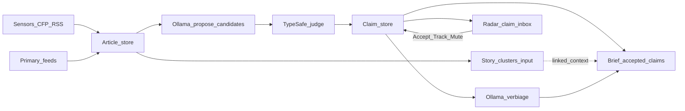

# Claims / evidence spine (conflict desk)

## Locked decisions

- **Domain (v1):** conflict / geopolitics.
- **Surface (v1):** hybrid — Radar = **claim inbox**; Brief = **accepted claims** plus **linked story clusters** for provenance/context (not story-first Accept).
- **AI split:** [TypeSafe / Jev](https://docs.typesafe.ai/introduction) = all structured judgments (Choice / Score / Noul + confidence routing). **Ollama** = claim-candidate **proposal** text + Brief **verbiage** only — not classifier-of-record.
- **Epistemology:** outlets = sensors (noise with signal); primaries = evidence signal. Cluster size ≠ confidence.
- **Honesty invariant (unchanged from pivot):** no “Verified” badges, no left/right trust grids, no claim **verdicts**. UI speaks **status + evidence**, not truth. Soften/supersede [NEWS-64](https://informedcrew.atlassian.net/browse/NEWS-64) (story-attached disagreements) into this epic rather than shipping it as written.
- **Desk verbs remapped:** Accept / Unaccept / Track / Mute / badge operate on **`claimId`**, not `clusterId`. Story membership APIs remain for linked-cluster display and migration, not as the operator’s primary object.
- **Roadmap:** new epic becomes **current next** ahead of parked B–G; desk v1 Done-demo stays done; Later story children of NEWS-57 (56/62/63/67 and old 64 scope) stay parked or get rewritten only if they serve claims.

## Product model (v1)

**Entities (JSON stores under `mvp/data/`, same flat-file pattern as desk v1):**

| Entity | Role |
|--------|------|
| **Claim** | Atomic assertion: `id`, `text`, `claimType`, `status`, `entities[]`, `createdAt`, optional `domain: conflict` |
| **EvidenceLink** | `claimId` + `articleId` (and/or URL) + `stance` (supports / contradicts / mentions) + TypeSafe scores/confidence + `sourceTier` |
| **ClaimMembership** | Accepted claim ids (Brief) |
| **TrackedClaims** | Track + `pendingUpdate` when **new evidence or stance change** (not cluster member count) |
| **MuteRules** | Extend or parallel: mute by keyword / entity / claimType / source (v1: keyword + optional source, matching claim text + linked headlines) |

**Claim types (closed set for TypeSafe Choice):** `event_occurrence` | `attribution` | `casualty_or_count` | `official_statement` | `territorial_or_control`

**Claim status (descriptive, not verdict):** `reported` | `supported_by_primary` | `contested` | `insufficient_evidence` — derived in **code** from evidence tiers + TypeSafe stance/confidence thresholds (never a “true/false” model output alone).

**Source tiers (config on each feed):** `primary` | `sensor` — extend [`mvp/server/config/radar-sources.json`](mvp/server/config/radar-sources.json) pattern; CFP + existing curated RSS = `sensor`; add a **small primary starter set** (file-config only): e.g. official release/RSS channels suitable for conflict (State/Defense/UN-class feeds — exact URLs locked in the epic’s source ticket). Primary articles preferred as evidence; sensor articles preferred as claim proposers.

## Pipeline (propose → judge → persist)

Attach after existing ingest/cluster in [`fetchAllSources.ts`](mvp/server/src/services/fetchAllSources.ts) / new post-fetch job (session-gated route, mirror classify):

1. **Ingest + cluster unchanged** — stories remain input ([`clusterArticles.ts`](mvp/server/src/services/clusterArticles.ts)).
2. **Propose (Ollama):** for new/unprocessed articles in domain, emit candidate claim spans `{ text, claimTypeGuess, quote }` — structured extraction only; no Accept decisions.
3. **Judge (TypeSafe), batched questions per candidate against state = article excerpt + existing similar claims:**
   - Noul: is this an assertable claim (vs opinion/commentary)?
   - Choice: claim type (closed set above)
   - Choice/Score: align to existing claim vs new
   - Choice: evidence stance vs claim
   - Score: primary-vs-sensor utility / novelty
   - **Confidence gate:** below threshold → `needs_review` queue (Radar section), not silent merge
4. **Persist** claims + evidence links; update status in code from evidence graph.
5. **Verbiage (Ollama):** only for **accepted** claims — short Brief summary / talking points; never overwrites TypeSafe fields.

Framing path ([`ollamaFraming.ts`](mvp/server/src/services/ollamaFraming.ts) / `POST /api/classify`) stays available for legacy story framing but is **not** the judgment path for the claim desk. Enrich can later target accepted claims; do not block v1 on rewriting enrich.

## API / UI rematerialization

**Server (new routes beside existing brief APIs in [`app.ts`](mvp/server/src/app.ts)):**

- `GET /api/claims/radar` — claim inbox (filter mute; include TypeSafe confidence + evidence counts + linked `clusterKey`s)
- `POST /api/claims/accept|unaccept`, track/untrack/ack, mutes CRUD
- `POST /api/claims/extract` (or fold into fetch) — propose+judge batch
- Keep story `/api/radar` + brief membership during transition; Brief owned adapter gains a **claims mode** section

**Kite hybrid:**

- `/radar` — primary list = claims (status, evidence chips, confidence); secondary/collapsible = linked sensor headlines/clusters
- `/` Brief — accepted claims as lead objects; expand shows linked cluster articles (reuse perspectives/citations patterns in adapter)
- Footer badge — pending **claim** track updates (evidence/stance), not story member growth

Document in [`docs/OWNED_BRIEF.md`](docs/OWNED_BRIEF.md), [`docs/MVP_API_COMPAT.md`](docs/MVP_API_COMPAT.md), [`docs/ROADMAP.md`](docs/ROADMAP.md), [`AGENTS.md`](AGENTS.md).

## TypeSafe integration (mvp/server)

- Env: `TYPESAFE_API_KEY` (+ model id) in [`mvp/.env.example`](mvp/.env.example)
- Client wrapper: `mvp/server/src/services/typesafeClient.ts` (JS SDK)
- Question library module: `mvp/server/src/services/typesafeClaimQuestions.ts` — atomic questions only; composite status in code ([composite scoring pattern](https://docs.typesafe.ai/patterns/composite-scoring.md), [confidence routing](https://docs.typesafe.ai/patterns/confidence-routing.md))
- Never log secrets; treat TypeSafe like Ollama (session-gated mutating routes)

## Jira / roadmap gate (before heavy code)

Create epic **J. Claims / evidence desk (conflict)** under NEWS with children roughly:

1. Schema + stores + status derivation rules + honesty copy
2. TypeSafe client + question library + confidence thresholds
3. Ollama propose candidates + extract route
4. Primary vs sensor source config (starter primaries)
5. Claim Radar API + Kite claim inbox UI
6. Accept / Track / Mute / badge on claims
7. Brief hybrid: accepted claims + linked clusters + Ollama verbiage
8. Docs + ROADMAP pointer; supersede NEWS-64 into this epic; comment Later children “parked pending claims spine”

Update [`docs/ROADMAP.md`](docs/ROADMAP.md) **Current next** to this epic; leave B–G parked.

## Out of scope for this epic (explicit)

- Crucix / geospatial raw layers (B/C) — design evidence tiers so they plug in later as primary evidence
- Birdclaw/X, Telegram as claim sensors (old 62/63) until claim desk works on CFP+RSS+primaries
- Full claim-graph UI / multi-domain
- Replacing Kite shell or reviving `_legacy` claims/Supabase
- Auto “truth” or Verified seals

## Done-demo (epic)

Operator runs fetch → sees **claims** on Radar (not only reprint clusters) → Accept one → Brief shows claim + linked outlets → primary-sourced support flips status to `supported_by_primary` without a Verified badge → contested when TypeSafe links contradicting evidence → Track fires on **new evidence**, not “another wire copied the headline.”

## Implementation note

Ship via `/news-ship-loop` + `/subagent-driven-development` per child story after the epic exists. First code slice after Jira/docs: stores + TypeSafe client + propose/judge on a fixture article (no UI), then Radar, then Brief hybrid.
