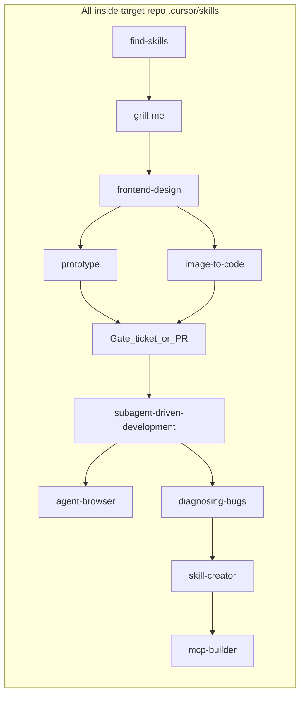

# Portable repo-local agent skills recipe

## Intent

Ship a **copyable playbook** that lives entirely inside whatever repo you apply it to:

1. Thoroughly flesh out ideas (`find` → `grill` → `design` / `prototype` / `vision`) **before** tickets/PRs.
2. Then implement / inspect / verify / package (`subagent-driven-development` → `agent-browser` / `diagnosing-bugs` → `skill-creator` / `mcp-builder`).
3. **All files stay under that repo** (`.cursor/skills/`, `AGENTS.md`, `docs/AGENT_SKILLS.md`). No `~/.cursor` installs. No cross-repo side effects.

Informed News is the **first application** of the recipe, not a global skills host.



## Hard constraint: repo-local only

| Do | Do not |
|----|--------|
| Install with `npx skills add … -a cursor --copy -y` from the **target repo root** (no `-g`) | Use `-g` / write to `~/.cursor/skills/` |
| Commit `.cursor/skills/**` in that repo | Assume another repo inherits skills |
| Copy `docs/AGENT_SKILLS.md` + AGENTS gate blurb into the next repo | Treat `informed-news/.cursor` as shared infrastructure |

Process gate (ideation before actionable work) is enforced by **docs + how you invoke skills**, not by splitting skill files across machines.

## Skill inventory (all committed in the target repo)

| # | Skill | Stage | Source |
|---|--------|--------|--------|
| 01 | `find-skills` | Shape | vercel-labs/skills |
| 02 | `grill-me` + `grilling` | Shape | mattpocock/skills |
| 03 | `frontend-design` | Shape | anthropics/skills |
| 04 | `agent-browser` | Verify | vercel-labs/agent-browser (stub; CLI separate) |
| 05 | `prototype` | Shape | mattpocock/skills |
| 06 | `diagnosing-bugs` | Verify | mattpocock/skills |
| 07 | `skill-creator` | Package | anthropics/skills |
| 08 | `image-to-code` | Shape | leonxlnx/taste-skill |
| 09 | `subagent-driven-development` | Build | obra/superpowers |
| 10 | `mcp-builder` | Package | anthropics/skills |

Keep each skill’s `LICENSE` / `LICENSE.txt`. Copy **full** trees for multi-file skills (not only `SKILL.md`).

## Install commands (run inside the target repo)

```bash
# From TARGET_REPO root — all project-local, no -g
npx skills add vercel-labs/skills --skill find-skills -a cursor --copy -y
npx skills add mattpocock/skills --skill grill-me --skill grilling --skill prototype --skill diagnosing-bugs -a cursor --copy -y
npx skills add anthropics/skills --skill frontend-design --skill skill-creator --skill mcp-builder -a cursor --copy -y
npx skills add vercel-labs/agent-browser -a cursor --copy -y
npx skills add https://github.com/Leonxlnx/taste-skill --skill image-to-code -a cursor --copy -y
npx skills add obra/superpowers --skill subagent-driven-development -a cursor --copy -y
# Fallback for #09: copy skills/subagent-driven-development/ from obra/superpowers manually
```

If the CLI also creates `.agents/skills/`, consolidate into **`.cursor/skills/`** and commit only that tree (avoid duplicate discovery).

Normalize `image-to-code` folder name to match frontmatter `name` if the install uses a different directory name.

Optional per-repo: add `agent-browser` as a devDependency and run `agent-browser install` (Chrome for Testing). Do not vendor the binary into git.

## What lands in git (per repo that adopts the recipe)

| Path | Purpose |
|------|---------|
| `.cursor/skills/<each-skill>/` | Full skill trees (10 + `grilling`) |
| `skills-lock.json` | CLI lockfile (source + content hashes) |
| `docs/AGENT_SKILLS.md` | **Portable recipe**: install/update commands, stage table, license notes |
| `AGENTS.md` (or create one) | Short **Agent skill loop** gate |

### Gate blurb (portable; swap tracker name per project)

1. **Shape first:** `/find-skills` → `/grill-me` → `/frontend-design` and/or `/prototype` / `/image-to-code` until scope is sharp. Do not start product implementation from a vague idea.
2. **Gate:** create/update the project tracker item (for Informed News: **NEWS** on Atlassian) only when scope, UX direction, and open questions are resolved.
3. **Build:** `/subagent-driven-development` → `/agent-browser` / `/diagnosing-bugs` → `/skill-creator` / `/mcp-builder` as needed.
4. **Product invariants** still win (for Informed News: Kite + `mvp/server`, no `_legacy/` default, etc.).

Prototypes stay disposable and off the default product entrypoint.

## Applying this to Informed News (first run)

1. Run the install block from `informed-news` root.
2. Normalize to `.cursor/skills/` only; keep licenses.
3. Add `docs/AGENT_SKILLS.md` (full portable recipe).
4. Add the gate section to [AGENTS.md](AGENTS.md) with NEWS-specific tracker wording.
5. Optionally add `agent-browser` devDependency.
6. Commit only skill trees + docs (+ optional lockfile). No secrets, no `mvp/data`.

No product code changes under `apps/kite` / `mvp/server` required for adoption.

## Copying into another existing repo

1. Copy `docs/AGENT_SKILLS.md` into the other repo (or re-run the same install commands from that doc).
2. From **that** repo’s root, run the install block (writes only into that repo’s `.cursor/`).
3. Paste the gate blurb into that repo’s `AGENTS.md`, swapping tracker/project invariants.
4. Commit in **that** repo.

That is the entire multi-repo story: **repeat the recipe locally**. Nothing in Informed News updates other projects.

## Coexistence (Informed News)

- **Rules > gate process > skills > ad-hoc chat.**
- `frontend-design` skill + existing frontend user rule + AGENTS.md constraints can all apply; product hard “don’ts” win.
- Keep `cursor-ide-browser` MCP; `agent-browser` is optional scripted verify.
- Existing MCPs unchanged; use `mcp-builder` only when adding a server.
- Do not migrate `.cursor/rules/*.mdc` in this pass.

## Verification

- `~/.cursor/skills/` was **not** used for this adoption (or left untouched by these commands).
- Target repo `.cursor/skills/` contains all listed skills + `grilling`.
- `/grill-me` works from a chat in that repo; AGENTS.md tells the agent not to skip the tracker gate.
- Cloning the repo alone is enough for Cloud Agents / teammates to see the full stack.

## Adopting mid-epic (Informed News)

This recipe does **not** require re-grilling or reopening work already done under the current Epic (e.g. Epic A / NEWS-33).

| Situation | What to do |
|-----------|------------|
| Completed / accepted Epic items | Leave them. No mandatory re-question. |
| Vague or unstarted backlog ideas | Run the shape loop (`/grill-me`, etc.) **before** starting implementation. |
| Grilling yields a **new** need | Create an **additional** NEWS item (Story/Task/Bug) under the Epic (or a new Epic if scope is truly separate). |
| Grilling changes an **open** item | Edit that issue’s scope; do not invent a parallel ticket unless it splits cleanly. |
| Grilling implies rework of shipped work | New ticket (Bug/Story) for the delta—explicit revisit, not an automatic redo of the whole Epic. |

Default: **forward-only**. The gate applies to what you start next, not a retrospective of the entire Epic unless you choose a focused re-grill of remaining open questions.

## Out of scope

- Any `-g` / machine-global skill install as part of this plan.
- Changing Kite / `mvp/server` product code for skill adoption.
- Auto-rolling the recipe into every other repo in one pass.
- Replacing shrimp-task-manager or requiring the full Superpowers plugin.
- Making throwaway prototypes the default `npm run dev` UI.
- Mandatory re-litigation of finished Epic work.
