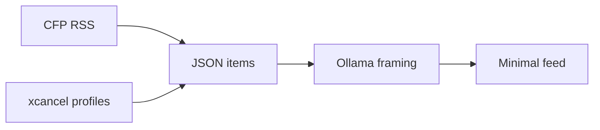
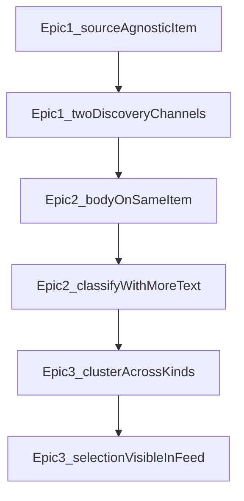

# MVP mission and sequenced NEWS epics

NEWS-1 (CFP ingest → Ollama framing → thin feed) is **Done**. This plan does not change that path. It writes the product mission and the next Jira backlog.

**This plan’s deliverable after approval:** create three Epics and their stories in the NEWS project. **No product code** until you ask to implement Epic 1.

Epic 2 and Epic 3 stories are written at the same grain as Epic 1 so Jira is not empty. They are **rewrite-before-build**: when that epic becomes current, we adjust them from what Epic 1 actually taught us (see [Iteration and relatability](#iteration-and-relatability)).

## Mission (north star)

Informed News is a personal reading tool for **getting closer to what happened**, and **noticing bias when language, selection, or certainty is doing rhetorical work**.

It will not claim to be unbiased. It will not output a left/right score. Framing stays **AI-assisted analysis, not ground truth**.

How the three epics serve that:

- **Sources** — CFP is a strong breaking-news aggregator, not the only lens. A few X profiles you already follow are a second discovery channel.
- **Depth** — facts live in the original, not the aggregator headline. Classify more than title + RSS snippet.
- **Corroboration** — authenticity comes from seeing the same event across sources, not from a “neutral” model.

UI stays a **password login + one feed**. Iterate from there.

## Locked decisions (this phase)

- Stay on the MVP stack: Express + JSON store + thin React. Do not wire `_legacy/` OSINT, Supabase, Hetzner Playwright, or X API.
- CFP remains a first-class source. xcancel is additive.
- **xcancel is a Nitter instance** ([about](https://xcancel.com/about)) and advertises **RSS**. Probe `https://xcancel.com/{handle}/rss` first; HTML timeline parse is the fallback. (HTML-only is a reasonable assumption if RSS is Cloudflare-blocked.)
- Profile list is a **local JSON/env list of handles**, not a settings UI.
- One combined feed. Source shown as a small chip (`CFP` or `@handle`). Citations stay dual: CFP + original, or xcancel + `x.com` permalink.
- Rate-limit and fail honestly. No stealth browser in Epic 1.
- Re-fetch must **not wipe** an existing classification when the item is unchanged.

## Explicit non-goals (all three epics)

- Left/right or partisan bias scores
- X API, login-to-x.com, Playwright/Hetzner scraper, self-hosted Nitter
- Porting `_legacy` Xcom profile UI / org model
- Multi-user, cloud DB, Vercel API
- Paywall bypass or “full OSINT” topics/watches/indicators
- Fact-check vendor APIs or classifier accuracy benchmarks
- A richer UI (filters, search, dashboards) until you ask for it

---

## Epic 1 — Multi-source ingest (implement next)

**Jira summary:** Multi-source ingest: CFP + xcancel profiles

**Goal:** Same minimal feed, two discovery channels. CFP keeps working. A curated handle list ingests via xcancel (RSS-first).

**Why first:** The article model is CFP-hardcoded (`cfpUrl` identity, “Refresh CFP”). A second source without generalizing that will paint us into a corner.

### Stories (create under this epic)

1. **Source-agnostic item model** — Evolve [`mvp/server/src/types/article.ts`](mvp/server/src/types/article.ts) (and web `types.ts`) so identity is not CFP-only. Keep a migration path for existing `articles.json`.
   - Add `sourceKind: 'cfp' | 'xcancel'`
   - `canonicalUrl` as the stable id input (CFP item URL or tweet URL)
   - `citations: { label, url }[]` (replace hardcoded CFP/Original-only UI)
   - Keep `publisherUrl` / `publisherDomain` for CFP; add `handle` (nullable) for X
2. **Preserve classification on upsert** — [`cfpFetch.ts`](mvp/server/src/services/cfpFetch.ts) currently resets `classification: null` on every fetch. Upsert should keep classification when title/snippet/canonical URL are unchanged.
3. **xcancel ingest** — New service, Cheerio (already used). Sequential, polite delay, small `FETCH_LIMIT`-style cap per profile.
   - Config: `XCANCEL_PROFILES` (comma-separated) and/or `mvp/data/x-profiles.json` (gitignored) + example in `.env.example`
   - Try RSS, then HTML `.timeline-item` (same DOM family as [`_legacy/backend/src/services/ingestion/NitterScrapingService.ts`](_legacy/backend/src/services/ingestion/NitterScrapingService.ts) — **copy the parse idea, do not import legacy**)
   - Map tweet → Article: title = truncated text, snippet = full tweet text, citations = xcancel + `https://x.com/{handle}/status/{id}`
   - Cloudflare / empty / 403: record `meta.lastError`, do not fake success
4. **Unified refresh + classify** — One `POST /api/fetch` (or fetch-all) that runs CFP then xcancel. Classify stays the existing batch path; tweets use the same `FramingAnalysis` schema (genre will often be `opinion` / `unclear`).
5. **Minimal UI** — [`Feed.tsx`](mvp/web/src/Feed.tsx) / [`ArticleCard.tsx`](mvp/web/src/ArticleCard.tsx): one **Refresh** button; source chip; citation links from `citations[]`. No profile manager, no second page.
6. **Smoke + env** — Update [`mvp/SMOKE.md`](mvp/SMOKE.md), [`mvp/.env.example`](mvp/.env.example), root README: CFP still works with empty profile list; with 1–2 handles, X items appear and classify.

**Acceptance (Epic 1):** Login → Refresh → see CFP items and (if configured) xcancel items in one list → Classify new → framing bars + honesty copy → citations open the right destinations. Empty `XCANCEL_PROFILES` = CFP-only, no errors.

---

## Epic 2 — Deeper original text (roadmap; rewrite before build)

**Jira summary:** Deeper original text for framing and facts

**Goal:** Classification and reading are based on more than the aggregator headline. Facts live on the publisher page (or in the tweet itself). The UI never implies you read the original if we only have a headline.

**Depends on Epic 1:** `sourceKind`, `canonicalUrl`, `citations[]`, and preserve-classification-on-upsert. Body hangs on the same item; we do not invent a second store.

**xcancel items:** the tweet text already *is* the body. Mark `bodyStatus: 'not_applicable'` (or treat snippet as body). Do not scrape `x.com`.

### Stories (create under this epic)

1. **Body fields on the item** — Extend [`article.ts`](mvp/server/src/types/article.ts) (and web types). No scrape yet; existing CFP/xcancel items stay valid.
   - `bodyText: string | null` (truncated, e.g. ~8–12k chars)
   - `bodyStatus: 'ok' | 'unavailable' | 'blocked' | 'not_applicable' | 'pending'`
   - `publisherTitle: string | null` (publisher `<title>` / og:title vs CFP headline)
2. **Best-effort publisher body scrape** — New service next to [`publisherScrape.ts`](mvp/server/src/services/publisherScrape.ts) (that file only finds a URL today). For `sourceKind === 'cfp'` with `publisherUrl`: fetch, extract main text (Cheerio / readability-style selectors), cap length, timeout, 1 retry, sequential/polite.
   - **No paywall bypass.** Login walls, 403, empty boilerplate → `blocked` or `unavailable`
   - Failure must not drop the item or wipe classification
   - Respect the same User-Agent / delay habits as CFP fetch
3. **Classify on body when present** — [`ollamaFraming.ts`](mvp/server/src/services/ollamaFraming.ts): optional `bodyText` in the prompt; still “do not invent facts.” Fallback = title + snippet when body is missing. Reclassify when body newly becomes `ok`; otherwise keep Epic 1’s preserve-on-upsert rule.
4. **Minimal UI: depth honesty** — [`ArticleCard.tsx`](mvp/web/src/ArticleCard.tsx) already expands framing. Add: short body excerpt when `ok`; “Original text unavailable” / “blocked” when not; if `publisherTitle` differs from CFP `title`, show both. Still one feed, no article-detail route.
5. **Smoke + env** — [`mvp/SMOKE.md`](mvp/SMOKE.md): after Refresh, some CFP items have `bodyStatus: ok` and some do not; Classify uses body when present; xcancel items stay `not_applicable` and still classify.

**Acceptance (Epic 2):** You can tell from the card whether you are looking at a headline or original text. Framing on a body-ok CFP item can cite evidence from the article, not only the RSS blurb. Paywalled/failed originals are honest, not silent.

**Out of this epic:** clustering, fact-check APIs, UI redesign, scraping tweet threads beyond the post text we already ingested.

---

## Epic 3 — Cross-source corroboration (roadmap; rewrite before build)

**Jira summary:** Cross-source corroboration and selection bias

**Goal:** Help you see when CFP, a publisher, and an X profile are talking about the same event — and when the aggregator’s *selection* (what it chose to headline) is the framing.

**Depends on Epic 1 + 2:** peer items in one feed; optional body; `publisherTitle` vs CFP title. Grouping quality is a product taste question — expect to rewrite these stories after you have used the two-source feed for a while.

### Stories (create under this epic)

1. **Cluster id on items** — Add `clusterId: string | null` on the article. Crude first pass only: overlapping URLs, same publisher domain + similar title tokens, or a tweet that links the publisher URL. No separate `clusters.json` unless the JSON store gets messy. Wrong groups are acceptable if they are obvious and undoable (null cluster = today’s flat list).
2. **Cluster in the same feed** — [`Feed.tsx`](mvp/web/src/Feed.tsx): related items render as one expandable group (lead CFP card + linked X posts / extra citations). Ungrouped items stay as they are. No dashboard, no graph, no second page.
3. **Verify-this list** — On the group (or expanded card), show `openQuestions` plus a plain-language note when `omissionOrSelectionRisk` is high. Keep the honesty line. This is a reading checklist, not a fact-check verdict.
4. **Headline vs original as selection signal** — When CFP `title` ≠ `publisherTitle`, or a CFP item has no matching X/publisher body, surface that as selection/omission — the existing dimension, made visible with the two headlines. Smoke: two related items group; unrelated stay flat; differing headlines are visible.

**Acceptance (Epic 3):** You can notice “these are the same event” and “CFP’s headline is doing selection work” without leaving the feed. The app still does not declare what is true.

**Out of this epic:** network graphs, geo, OSINT topic/watch/indicator model, vendor fact-check APIs, left/right scores.

---

## Iteration and relatability

Stories are a **capability chain**, not a frozen spec. Each one should still be useful if we stop after it.

**What stays relatable**

- Epic 1 leaves a **generic item** (`sourceKind`, `canonicalUrl`, `citations[]`). Epic 2 adds **text on that item**. Epic 3 **groups items**. Nothing requires a new product surface.
- Every story is independently shippable: the feed keeps working if we never start the next one.
- Relatable in use means each story answers “can I notice something I could not before?” — another source, original text vs headline, same event / selection — not “did we build a subsystem.”

**What we expect to rewrite**

- **Before starting Epic 2 or 3**, re-read the stories against the running app. Split, drop, or reword freely. Placeholder AC is a guess.
- Epic 1 will change Epic 2: if xcancel is RSS-only vs HTML, if Cloudflare blocks us, if CFP publisher URLs are often null, body scrape scope shrinks.
- Epic 3 is the most likely to change after you *use* the two-source feed. Clustering is taste. We may decide grouping is noise and keep a flat list plus the verify-this list only.

**How to iterate without thrash**

- Do not implement a later story “because it is in Jira.” When an epic becomes current, the first task is **rewrite the stories**, then code.
- Prefer shrinking a story over adding a settings page, a new route, or `_legacy` OSINT types.
- If a story no longer maps to the mission (authentic news, visible framing, minimal UI), close it as won’t-do and say why on the epic.

---

## Jira (created)

Site: `informedcrew.atlassian.net` / cloudId `ebcd227d-1f6d-4a54-a6d7-cfe70e377a50` / project **NEWS**. Mission epics branch: `feat/mvp-mission-epics`. Inspired-by alignment branch: `feat/jira-inspired-backlog-align`.

- [NEWS-12](https://informedcrew.atlassian.net/browse/NEWS-12) Multi-source ingest: CFP + xcancel profiles — Epic, Highest — stories NEWS-15–20
- [NEWS-13](https://informedcrew.atlassian.net/browse/NEWS-13) Deeper original text for framing and facts — Epic, High — stories NEWS-21–25 (blocked by NEWS-12)
- [NEWS-14](https://informedcrew.atlassian.net/browse/NEWS-14) Cross-source corroboration and selection bias — Epic, Medium — stories NEWS-26–29 (blocked by NEWS-13)
- [NEWS-30](https://informedcrew.atlassian.net/browse/NEWS-30) Later roadmap: archives, transparency, and parked platform-inspired ideas — Epic, Low — NEWS-31 (archive links), NEWS-32 (Transparency Page)

Do **not** start coding NEWS-12 until explicitly asked. Do **not** start NEWS-30 until explicitly asked.

## Platform-inspired backlog (aligned, not duplicated)

Source prompt (kept for history, do not re-execute as written): [informed-news-jira-agent-prompt.md](informed-news-jira-agent-prompt.md).

A 2026 review of Bellingcat / Ground News / AllSides / Ad Fontes / NewsGuard / Readless / Tangle / PolitiFact ideas was mapped onto this plan instead of creating six competing epics. Locked non-goals still hold: no left/right scores, no claim verdicts, thin feed.

| Inspired-by idea | Disposition |
| --- | --- |
| Methodology / verification transparency | Folded into NEWS-12 citations + NEWS-28 verify-this list. No Bellingcat panel or “Verified” badge. |
| Coverage comparison / blindspots | **Won’t-do for MVP.** NEWS-14 groups same-event items without partisan scores. |
| Outlet trust scoring / bias chart | **Won’t-do for MVP.** Explicit non-goal. |
| Dedup / synthesis | NEWS-26/27 stay crude URL/title overlap. No embeddings or digest. |
| Facts vs opinion format | NEWS-13/24 depth honesty + existing genre. No Tangle three-section schema. |
| Claim-level fact-check | **Won’t-do for MVP.** NEWS-28 is a reading checklist, not a verdict. |
| Archive links for citations | Parked: [NEWS-31](https://informedcrew.atlassian.net/browse/NEWS-31) under NEWS-30. |
| Public Transparency Page | Parked: [NEWS-32](https://informedcrew.atlassian.net/browse/NEWS-32) under NEWS-30. |
