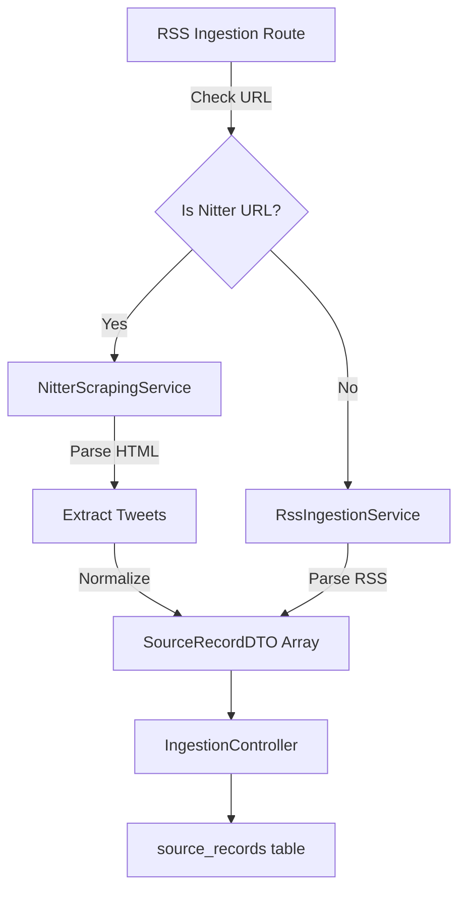

# Nitter Scraping Service Implementation

## Overview

Create a `NitterScrapingService` that parses Nitter HTML pages to extract tweets and normalizes them into `SourceRecordDTO` format. The service will integrate with existing RSS ingestion by detecting Nitter URLs in the RSS ingestion route and routing them to the scraping service instead.

## Architecture

## Implementation Steps

### 1. Create NitterScrapingService

**File:** `backend/src/services/ingestion/NitterScrapingService.ts`

- Implement `IngestionService` interface
- Configuration: `sourceId`, `nitterUrl`
- Parse HTML using `cheerio` (already available)
- Extract tweets from `.timeline-item` elements
- Parse tweet data:
- Username from `.username` link
- Full name from `.fullname` link  
- Content from `.tweet-content.media-body`
- Date from `.tweet-date > a[title]` attribute (e.g., "Jan 5, 2026 · 3:01 AM UTC")
- Tweet URL from `.tweet-link[href] `(relative path like `/username/status/ID#m`)
- Stats from `.tweet-stats` (comments, retweets, likes, views)
- Retweet indicator from `.retweet-header`
- Quote tweets from `.quote.quote-big`
- Build full URLs by combining base URL with relative paths
- Parse relative time strings (e.g., "2s", "1h", "Jan 4") into Date objects
- Normalize to `SourceRecordDTO` format
- Handle language detection and geographic indicators (similar to `RssIngestionService`)

### 2. Add Date Parsing Utility

**File:** `backend/src/utils/dateParser.ts` (new file)

- Function to parse Nitter date strings:
- Relative times: "2s", "25m", "1h", "10h" → calculate from current time
- Absolute dates: "Jan 5, 2026 · 3:01 AM UTC" → parse directly
- Date-only: "Jan 4" → parse as date (time defaults to start of day)
- Handle timezone parsing from UTC strings
- Return `Date` object or `null` if parsing fails

### 3. Update RSS Ingestion Route

**File:** `backend/src/routes/ingest.ts`

- Add import for `NitterScrapingService`
- Create helper function `isNitterUrl(url: string): boolean` to detect Nitter instances
- Check if URL contains "nitter" or matches nitter domain patterns
- Modify `/rss` route handler:
- After fetching source, check if URL is a Nitter URL
- If Nitter URL: use `NitterScrapingService` instead of `RssIngestionService`
- If regular RSS: use existing `RssIngestionService` (no changes)
- Update `/rss/all` route handler similarly:
- Check each source URL for Nitter pattern
- Route to appropriate service per source

### 4. Export Service

**File:** `backend/src/services/ingestion/index.ts`

- Add export for `NitterScrapingService`

### 5. URL Handling

- Nitter URLs can be:
- Search URLs: `https://nitter.poast.org/search?f=tweets&q=query`
- User timeline URLs: `https://nitter.poast.org/username`
- Build full tweet URLs by combining base URL (from source URL) with relative paths
- Extract base URL from source URL (protocol + hostname)

## Data Mapping

### Tweet HTML → SourceRecordDTO

- **title**: `@username: ${tweetContent.substring(0, 100)}...` (truncate if needed)
- **url**: Full URL constructed from base + `.tweet-link[href]`
- **content**: Full tweet content from `.tweet-content.media-body`, include quote tweet text if present
- **published_at**: Parsed date from `.tweet-date > a[title]` attribute
- **language**: Detect from content (similar to RSS service)
- **geographic_indicators**: Extract from content (similar to RSS service)
- **raw_metadata**:
- `username`: Twitter username
- `fullname`: Display name
- `is_retweet`: Boolean (if `.retweet-header` exists)
- `retweeted_by`: String (if retweet, extract from retweet header)
- `stats`: Object with `comments`, `retweets`, `likes`, `views`
- `has_quote`: Boolean
- `quote_tweet_url`: String (if quote tweet exists)
- `nitter_instance`: Base URL of Nitter instance
- `source_url`: Original source URL

## Error Handling

- Handle missing HTML elements gracefully (tweets may have varying structures)
- Handle date parsing errors (fallback to current date if parsing fails)
- Log parsing errors but continue processing other tweets
- Return empty array if HTML structure is completely invalid

## Testing Considerations

- Test with the provided HTML structure
- Test date parsing with various formats
- Test URL construction with different Nitter instances
- Test handling of retweets and quote tweets
- Ensure existing RSS feeds continue to work unchanged

## Files to Modify

1. `backend/src/services/ingestion/NitterScrapingService.ts` (new)
2. `backend/src/utils/dateParser.ts` (new)
3. `backend/src/routes/ingest.ts` (modify)
4. `backend/src/services/ingestion/index.ts` (modify)

## Future Enhancement: Playwright Integration

**Status**: Analysis complete, implementation pending**Issue**: Some Nitter instances use Cloudflare bot protection (503 errors with "Verifying your browser" challenge)**Solution**: Integrate Playwright headless browser to bypass Cloudflare challenges**Analysis Document**: See `docs/NITTER_PLAYWRIGHT_ANALYSIS.md` for detailed comparison of Puppeteer vs Playwright**Key Findings**:

- **Playwright recommended** over Puppeteer for:
- Better bot detection evasion (more realistic fingerprints)
- Faster startup times (1-2s vs 2-3s)
- Better serverless compatibility
- Alignment with future e2e testing needs
- Multi-browser support (can switch if one gets detected)

**Implementation Requirements**:

- Add `playwright` dependency (~100MB for Chromium only)
- Update `NitterScrapingService` to use Playwright instead of axios
- Handle browser lifecycle (launch, navigate, extract HTML, close)
- Consider serverless limitations (Vercel function size/memory limits)
- Estimated time: 6-12 hours
- Estimated cost: $0-20/month (depending on Vercel tier)

**Alternative Approaches**:

1. **External Browser Service**: Use Browserless.io, ScrapingBee, or ScraperAPI

- Pros: Simplifies deployment, offloads browser management
- Cons: Adds cost ($49-99/month), external dependency

2. **Separate Worker Service**: Deploy browser service separately (Railway, Render)