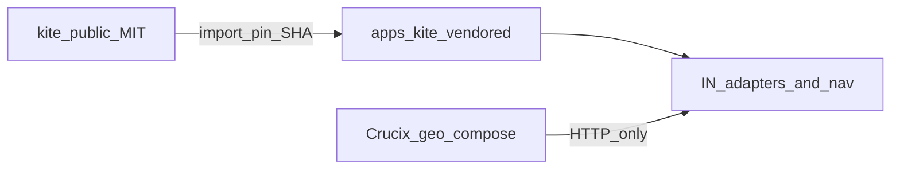
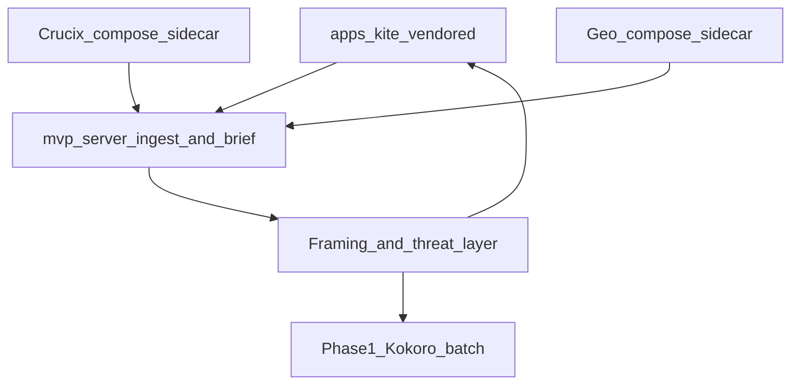
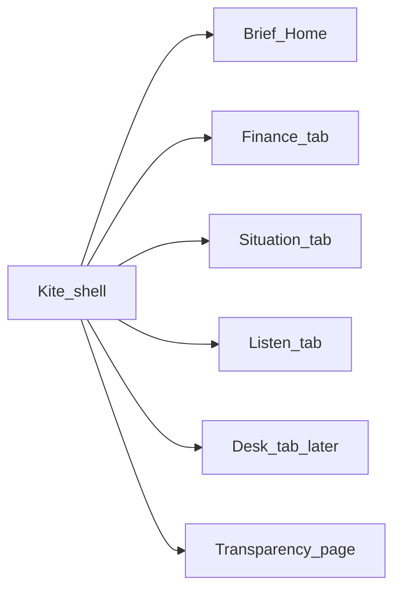

# Pivot NEWS to the OSINT strategy (high level)

This is a **mission rewrite**, not a feature add on the CFP feed. NEWS-1–14 stay as the closed MVP chapter. New work follows the strategy’s [recommended build order](file:///Users/philipclapper/Downloads/Informed_News_OSINT_Strategy_Summary.md) (section 8), with Kite’s MIT front end living in **this** repo.

## Should everything live in this repo?

**No — not the whole landscape.** Put in this repo what you will own and ship. Treat the rest as upstream services.

| In this repo | Not in this repo |
|---|---|
| Kite front-end fork (`github.com/kagisearch/kite-public`, MIT) | World Monitor (AGPL-3.0 — do not merge into this proprietary LICENSE) |
| RSS / brief / classification / TTS you write | Crucix, Shadowbroker, IRONSIGHT **source** (self-host via Compose/submodule; talk to them over APIs) |
| Golden-file QA **suites** for this pipeline | HARN product itself (sibling repo that *runs* the suites) |
| Existing `mvp/` framing classifier (reuse, don’t throw away) | `_legacy/` OSINT monolith (reference only; do not make it `npm run dev`) |

Perplexity finance is a **connector**, not code to vendor. Phase 2 LiveKit is last by design.

This repo is proprietary ([LICENSE](LICENSE)). MIT Kite can be forked here with attribution. AGPL World Monitor cannot be folded in without relicensing the combined work.

## How orgs handle forked open source (and what we do)

Companies rarely “paste a GitHub repo into main and forget it.” They pick a **relationship to upstream** based on how much they will customize and how often they need updates.

### Common patterns

| Pattern | When orgs use it | Pros | Cons |
|---|---|---|---|
| **Dependency (npm/cargo/apt)** | Library you don’t change | Auto updates, no copy | Useless if you need a deep FE fork |
| **Git submodule** | Keep upstream history; occasional bumps | Clear upstream pin; easy `git submodule update` | Awkward DX; two remotes in one tree |
| **Git subtree / vendored snapshot** | Soft fork inside monorepo | One clone for builders; you own the tree | Syncing upstream is a deliberate merge |
| **Org fork + thin integration** | You customize heavily; product wraps it | Upstream sync via PRs on the fork; app stays clean | Two repos to operate |
| **Docker / Compose only** | You run their service, don’t rewrite it | No license entanglement of their code into yours | Not “in the app”; API coupling only |

**License is the hard gate:** MIT/Apache → you may copy into a proprietary product with attribution. GPL/AGPL → combining into a proprietary app usually forces the combined work open (or you keep it **process-isolated** as a separate service you call over HTTP, never ship their source inside your proprietary tree).

### What professionals do day to day

1. **Record provenance** — `NOTICE`, `THIRD_PARTY`, or per-package `LICENSE` with upstream URL + commit SHA + license name.
2. **Pin a commit** — never track `main` live; bump deliberately.
3. **Minimize the diff** — prefer config, theme, and adapter layers over rewriting upstream files; keep a short `UPSTREAM.md` (“how we diverge”).
4. **Sync on a cadence** — quarterly or when security fixes land; one person owns the bump PR.
5. **Don’t rewrite history** — keep upstream authors’ copyright headers; your proprietary LICENSE covers *your* code, not a claim that MIT code became proprietary IP.

### Recommended for Informed News

| Component | Pattern | Why |
|---|---|---|
| **Kite FE** | **Vendored soft fork** under e.g. `apps/kite/` (or `kite/`) via subtree or one-time import + recorded SHA | You will customize nav, transparency, tabs; MIT allows it; monorepo matches “Kite is the product UI” |
| **Crucix / Shadowbroker / IRONSIGHT** | **Compose-only upstream** (optional submodule for pin) | Run as sidecars; talk HTTP/API; avoid AGPL/GPL entanglement and giant merges |
| **HARN** | **Sibling repo** | Runner stays separate; this repo holds fixtures/suites |
| **World Monitor** | **Out** (or isolated AGPL service you never merge) | AGPL + proprietary LICENSE conflict if combined |

**Kite import procedure (Epic A story 1 deliverable):**

1. Record upstream: `https://github.com/kagisearch/kite-public` @ `<commit>` (MIT).
2. Import into `apps/kite/` (subtree preferred if you expect occasional upstream pulls; snapshot OK if you expect to diverge hard).
3. Add root `NOTICE` / `THIRD_PARTY.md` with MIT text + attribution.
4. Keep Informed News–only glue in `apps/kite` wrappers or a thin `apps/shell` — avoid editing upstream files when a wrapper works.
5. Document sync: `docs/UPSTREAM_KITE.md` with last SHA and “how to bump.”



Do **not** git-merge unrelated remotes into `main` history casually; import as a directory with provenance, or use subtree with an explicit upstream remote.

### Concrete layout in *this* repo

We will **not** nest multiple `.git` remotes as day-to-day workflow (no “repo inside a repo” for developers). One git repo; different *origins* show up as **directories or Compose services**.

```
informed-news/                    # single git root (proprietary)
├── apps/
│   └── kite/                     # VENDORED soft fork of kite-public @ pinned SHA
│       ├── (upstream tree)
│       └── UPSTREAM.md           # SHA, license, how we diverge
├── mvp/                          # existing Informed News API + old FE (compat / classify)
│   ├── server/                   # keep: framing, store, adapters grow here
│   └── web/                      # freeze as default UI; not npm run dev entry
├── packages/                     # optional later: shared types between kite + server
├── deploy/
│   └── compose/
│       ├── crucix.yml            # pulls/runs upstream image or clone path — not our source
│       └── geo.yml               # Shadowbroker OR IRONSIGHT — sidecar only
├── qa/
│   └── suites/                   # golden files / citation checks (HARN runs these)
├── docs/
│   ├── UPSTREAM_KITE.md
│   └── UPSTREAM_SERVICES.md      # compose pins, ports, health URLs
├── THIRD_PARTY.md                # all vendored licenses + SHAs
├── NOTICE
└── package.json                  # npm run dev → apps/kite (+ mvp/server)
```

| What you might call a “repo” | Where it lives | How we treat it |
|---|---|---|
| Kite | `apps/kite/` **source in our tree** | One import; our commits own the folder; bump via documented sync |
| Crucix | **Not** copied into `apps/` | `deploy/compose/crucix.yml` starts it; our code only in `mvp/server` adapters |
| Shadowbroker / IRONSIGHT | Same as Crucix | Compose sidecar; pick one for v1 |
| HARN | **Outside** this repo | Sibling project; reads `qa/suites/` |
| World Monitor | Nowhere here | Do not vendor |

**Rules of the road:**
- **One clone** of Informed News is enough to develop the product UI + API.
- **Sidecar services** need Docker (or a documented local install); their git remotes stay optional for maintainers (`docs/UPSTREAM_SERVICES.md`), not required for every contributor.
- **No submodule tax** unless we later decide a sidecar must be pinned as source for builds — default is Compose + image/tag or documented clone path outside `apps/`.
- **`mvp/web` stays** until Kite fully replaces it; then archive or delete in a later story — don’t delete on day one.

### Open source vs closed source — is this setup OK either way?

**Yes.** Vendoring MIT Kite + Compose sidecars for Crucix/geo is the standard pattern that works for **both** proprietary and open-source products. What changes is the **root LICENSE** and how you publish artifacts — not the folder layout.

| Concern | Closed (current proprietary LICENSE) | Open (e.g. MIT/Apache for *your* code) |
|---|---|---|
| Kite in `apps/kite/` | Allowed with attribution (`THIRD_PARTY.md`) | Same — keep MIT notice; your license covers *your* edits/wrappers |
| Crucix / geo via Compose | Ideal — their code never enters your proprietary tree | Ideal — contributors run optional sidecars; you don’t ship their license into your core |
| World Monitor AGPL | Keep out of tree (or isolated service you don’t distribute as one binary) | Same — AGPL in-tree would force AGPL on the combined work |
| HARN sibling | Private or public independently | Same — suites in `qa/` can be MIT while HARN stays separate |
| Secrets / `.env` | Never commit | Never commit (same) |

**What does *not* work either way:** merging AGPL/GPL **source** into this repo and pretending the root stays proprietary (or “MIT but we copied AGPL”). Sidecar/process isolation is how companies ship mixed stacks under either model.

**Recommendation:**
1. **Keep the current integration model** (vendor MIT UI; sidecar everything else) regardless of whether you eventually open the repo.
2. **Stay proprietary for now** if the product and portfolio story are still private — no need to relicense to start Epic A.
3. **If you open later**, prefer **MIT or Apache-2.0** for *your* Informed News code so inbound MIT Kite stays simple; keep sidecars documented as optional upstream services; publish `THIRD_PARTY.md` in the root.
4. **Do not** open-source by dumping `_legacy/` + sidecars into one license blob — audit tree first.

Decision to record when Epic A lands: root stays proprietary until you explicitly relicense; architecture already allows a clean open later.



## What the pivot means in Jira

**Keep:** NEWS-1–14 (Done). Comment that they are the retired personal-feed MVP, not the live roadmap.

**Rewrite / reparent:**
- [NEWS-32](https://informedcrew.atlassian.net/browse/NEWS-32) Transparency Page — still valid; move under the first new epic (Kite UI / public pages).
- [NEWS-31](https://informedcrew.atlassian.net/browse/NEWS-31) Archive links — still valid; move under the QA/integrity epic (step 4).

**Close as superseded (do not delete):**
- [NEWS-30](https://informedcrew.atlassian.net/browse/NEWS-30) parking lot. Its “hard rejects” (left/right grids, claim verdicts, Verified badges, paywall bypass) **stay rejected**. Its “soft park” items (digests, ranking, maps, richer UI) are **reopened only as stories under the new epics**, not as that parking-lot epic.

**Do not** revive `_legacy` tickets or port topics/watches/indicators as the product path.

Also rewrite [AGENTS.md](AGENTS.md) when implementation starts: primary architecture is no longer “thin CFP React feed.”

## UI shape: Kite as shell, layers as pages/tabs

**Agree with the instinct.** Start with Kite as the main app (daily brief / clusters / citations — that *is* the product). Do **not** rebuild a multi-pane OSINT dashboard on day one. As epics land, add capability as **routes or nav tabs inside the Kite shell**, not as separate apps.



| Surface | When it appears | What the user sees |
|---|---|---|
| **Brief (home)** | Epic A | Kite’s native daily digest UI — default entry |
| **Transparency** | Epic A (NEWS-32) | Public page/route; not a feed tab |
| **Finance / macro** | Epic B | Tab or section fed by Crucix adapter (cited signals, not a Bloomberg clone) |
| **Situation / geo** | Epic C | Tab with a **thin** event list + optional map; pick one upstream, one theater focus at first |
| *(no QA tab)* | Epic D | Harness is CI/operator, not end-user chrome |
| **Framing / threat on cards** | Epic E | In-place on brief + tab cards — honesty copy, not a spectrum page |
| **Listen** | Epic F | Tab or header control: play today’s `brief.mp3` |
| **Desk** | Epic G | Full interactive voice route; last, not a stub tab in A |

**Guardrails (keep Kite feeling like Kite):**
- Home stays one composition (brief), not a dashboard of widgets.
- New tabs earn their place only when that epic’s **data deliverable** exists — empty tabs are out of scope.
- Prefer **enriching the brief** (extra citations, threat chip, play button) before adding a tab. Tab = a different job (scan finance, scan geo, listen, talk).
- Maps, live tickers, and voice are secondary surfaces; they must not overpower the brief brand/home.
- Hard rejects still apply on every surface: no left/right scores, trust grids, or claim verdicts.

Epic A should therefore include a small **nav shell** story (home + placeholder-ready routing) so B/C/F can plug in without another UI rewrite — but **do not ship empty Finance/Situation/Listen tabs** until those epics deliver data.

## Deliverable rule

Every Jira change (epic, story, and the board rewrite itself) names **one shippable artifact** you can demo or open. Work that cannot point at that artifact is out of scope for that ticket.

Format in each description:

- **Deliverable:** (path, URL, file, or command)
- **Demo:** (what you do in 60 seconds to prove it)

## Recommended NEWS epics (1:1 with build order)

Create **seven epics**, sequenced. Only Epic A is implement-next after the Jira rewrite. Epics B–G are shells with the epic-level deliverable written now; stories are added when that epic becomes current.

| Epic | Step | Epic Done when you can demo | Story-level deliverables (seed now for A; later for B–G) |
|---|---|---|---|
| **A. Kite presentation** | 1 | `npm run dev` opens **Kite**, not the CFP React feed | See stories below |
| **B. Crucix raw layer** | 2 | A finance/macro signal from Crucix appears as a cited card/row in Kite | Compose file that brings Crucix up; healthcheck URL; adapter writes ≥1 normalized item into the store |
| **C. Geospatial raw layer** | 3 | One geo/conflict event from **either** Shadowbroker **or** IRONSIGHT appears in Kite with a source link | One compose/upstream choice documented; adapter writes ≥1 geo item; Kite shows it |
| **D. QA harness skeleton** | 4 | `npm test` (or a named HARN job) fails a golden brief if a citation URL is dead or feed count is under 25 | Golden-file fixture; citation-check script with a failing fixture; NEWS-31 archive URL field on a citation |
| **E. Bias / threat classification** | 5 | A Kite cluster/card shows framing **and** a transparent threat tier (not left/right) with honesty copy | Extended analysis JSON on an item; UI chip/label; snapshot test that the prompt still says “not ground truth” |
| **F. Phase 1 TTS** | 6 | A daily `brief.mp3` is produced from that day’s brief and playable locally | Script `npm run tts:brief`; output file in a gitignored dir; SMOKE step to play it |
| **G. Phase 2 voice desk** | 7 | You can interrupt a live briefing and get a RAG answer with a citation | LiveKit session URL; one interrupt demo; groundedness check from D |

### Epic A stories (seed on create)

Each story is one PR-sized change with its own deliverable:

1. **Fork Kite into the repo** — Deliverable: `apps/kite/` (or `kite/`) at a pinned upstream SHA; `THIRD_PARTY.md` / NOTICE with MIT attribution; `docs/UPSTREAM_KITE.md` with sync steps. Demo: Kite UI loads on a documented port.
2. **Make Kite the default `npm run dev` target** — Deliverable: root scripts + README point at Kite; `mvp/` still typechecks but is not the entry UI. Demo: one command, Kite homepage (Brief).
3. **Rebrand shell to Informed News** ([NEWS-45](https://informedcrew.atlassian.net/browse/NEWS-45)) — Deliverable: product name/title/header/footer/logo chrome is Informed News; MIT notices retained. Demo: Brief chrome says Informed News, not Kagi News.
4. **Serve owned brief JSON** ([NEWS-44](https://informedcrew.atlassian.net/browse/NEWS-44)) — Deliverable: default config loads our brief (adapter from `mvp/server` / owned JSON), not `kite.kagi.com`. Demo: Brief content from our pipeline/fixture. *(Tight pair with NEWS-45, immediately after NEWS-41.)*
5. **Nav shell for future layers** — Deliverable: documented route map (Brief home + Transparency; Finance/Situation/Listen reserved, not empty-shipped). Demo: Brief is default; Transparency link works; reserved routes are documented, not fake tabs.
6. **NEWS-32 Transparency page** — Deliverable: a public `/transparency` (or Kite-equivalent) page reachable without login. Demo: open URL, see funding/methodology/honesty copy.
7. **CFP/xcancel still reachable (compat)** — Deliverable: existing MVP API still serves articles (or a documented freeze). Demo: health + one article JSON, even if the UI is Kite.
8. **Retire `mvp/web`** ([NEWS-46](https://informedcrew.atlassian.net/browse/NEWS-46)) — Archive to `_legacy/mvp-web/` (keep `mvp/server`). Demo: default scripts never start the old React feed; API still healthy. *Late in A; not a wholesale delete of `mvp/`.*

Do not seed B–G stories until A is Done. When seeding later, copy the story-level column into real tickets with the same Deliverable / Demo block.

## First execution slice (after you approve)

Each board action also has a deliverable:

1. **Comment NEWS-1–14** — Deliverable: a comment on each epic (or one comment on NEWS-1 plus the child epics 12–14) stating “closed MVP chapter; not the live roadmap.”
2. **Close NEWS-30** — Deliverable: status Done (or cancelled), comment listing what stays rejected vs what moved.
3. **Reparent NEWS-32 → A, NEWS-31 → D** — Deliverable: Jira parent field updated; descriptions get Deliverable / Demo lines.
4. **Create Epics A–G** — Deliverable: seven NEWS epics with build-order, blocker text (“B starts when A is Done”), and the epic Done-demo from the table.
5. **Seed Epic A stories** — Deliverable: the five stories above, each with Deliverable / Demo.

No application code in that slice unless you ask to start the Kite fork immediately after.