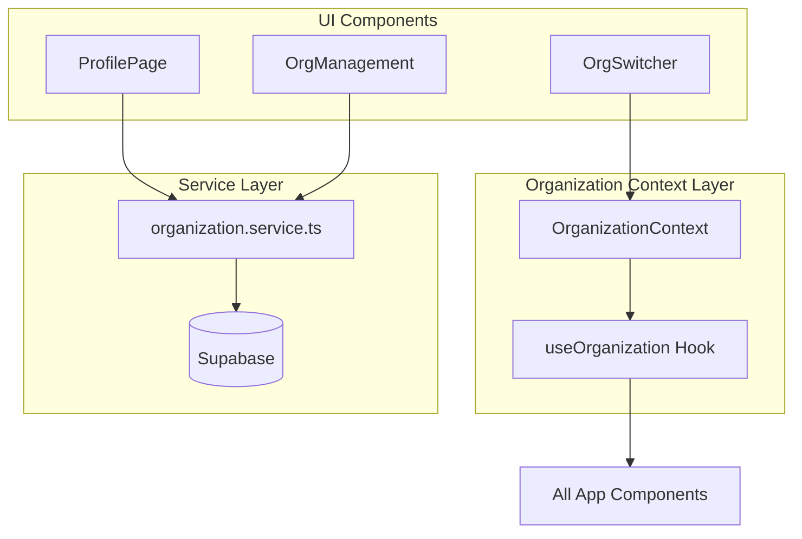
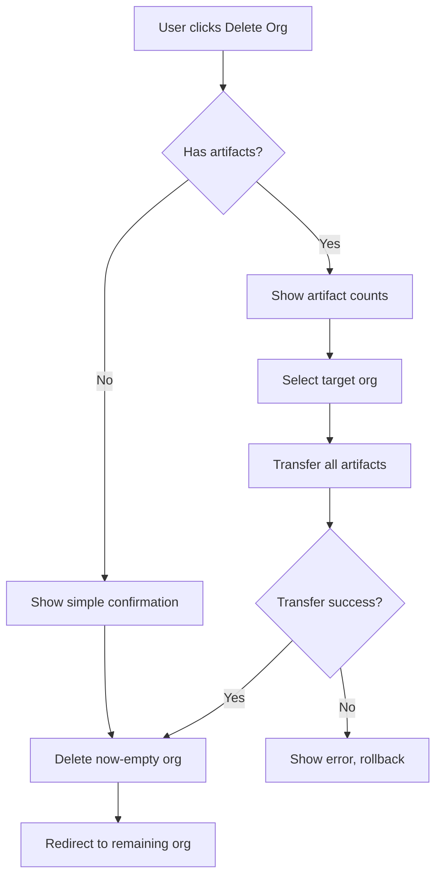
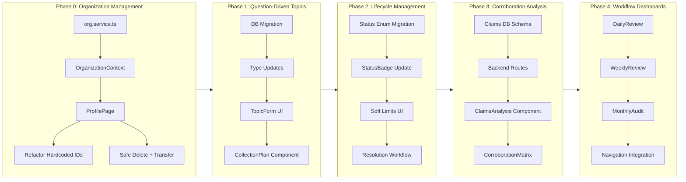

# OSINT Intelligence Workflow Enhancement

Transform the current topic tracking into a full intelligence-style analysis workflow that emphasizes question-driven investigation, selective ingestion, and structured decision-making.

## Current State

The project already has solid foundations:

- Topics with status (active/monitoring/archived), keywords, and descriptions
- TopicSourceLinks with confidence levels, analyst notes, and review status
- QA completeness scoring, timeline analysis, coordination detection
- Audit history tracking

## Gap Analysis

Missing from the OSINT practitioner workflow:

1. **Organization Management** - No UI to create/manage organizations (currently hardcoded)
2. **Decision Context** - Why does this topic matter? What decision depends on it?
3. **Collection Planning** - What evidence types are needed? What gaps exist?
4. **Key Indicators** - What would change your mind? When is the question answered?
5. **Expanded Lifecycle** - Need "suspended" and "resolved" statuses
6. **Corroboration Tracking** - Which claims are verified across sources?
7. **Workflow Guidance** - Daily/weekly/monthly review prompts

---

## Phase 0: Organization and Profile Management (Foundational)

The app currently has a hardcoded `organizationId` (`'00000000-0000-0000-0000-000000009997'`) in 6 components. This phase adds proper organization management so users can create, switch, and manage their organizations.

### Current Problem

Hardcoded organization ID in:

- `TopicDetailPage.tsx`
- `TopicsPage.tsx`
- `SourcesPage.tsx`
- `SourceRecordsPage.tsx`
- `SourceRecordDetailPage.tsx`
- `Header.tsx`

### Solution Architecture




### New Files

**[`src/services/organization.service.ts`](src/services/organization.service.ts)**:

```typescript
// Organization CRUD
getUserOrganizations(userId: string): Promise<Organization[]>
createOrganization(name: string, slug: string): Promise<Organization>
updateOrganization(id: string, updates): Promise<Organization>

// Membership
getMembers(orgId: string): Promise<OrgMember[]>
inviteMember(orgId: string, email: string, role): Promise<void>
removeMember(orgId: string, userId: string): Promise<void>
updateMemberRole(orgId: string, userId: string, role): Promise<void>
```

**[`src/context/OrganizationContext.tsx`](src/context/OrganizationContext.tsx)**:

```typescript
interface OrganizationContextValue {
  currentOrganization: Organization | null;
  organizations: Organization[];
  isLoading: boolean;
  switchOrganization: (orgId: string) => void;
  refreshOrganizations: () => Promise<void>;
}

export function useOrganization() {
  return useContext(OrganizationContext);
}
```

**[`src/components/Profile/ProfilePage.tsx`](src/components/Profile/ProfilePage.tsx)**:

- User profile info (email, display name)
- Current organization display
- Organization switcher dropdown
- "Create New Organization" button
- Organization settings (for owners/admins):
- Rename organization
- Manage members (list, invite, remove, change roles)
- Delete organization (with confirmation)

**[`src/components/Profile/OrganizationSwitcher.tsx`](src/components/Profile/OrganizationSwitcher.tsx)**:

- Dropdown component for Header
- Shows current org name
- Lists user's organizations
- Quick switch between orgs
- Link to Profile page for full management

### Refactoring Required

Remove hardcoded `organizationId` from these files and replace with `useOrganization()` hook:| File | Current | After ||------|---------|-------|| `TopicDetailPage.tsx` | `const organizationId = '00000...'` | `const { currentOrganization } = useOrganization()` || `TopicsPage.tsx` | Same | Same || `SourcesPage.tsx` | Same | Same || `SourceRecordsPage.tsx` | Same | Same || `SourceRecordDetailPage.tsx` | Same | Same || `Header.tsx` | Same | Same + add OrganizationSwitcher |

### Auto-Organization Creation

When a user signs up and has no organizations:

1. Automatically create a "Personal" organization for them
2. Add them as owner
3. Set as current organization

This ensures every user always has at least one organization.

### Profile Page Route

Add new route: `/profile`Navigation: Add user avatar/menu in Header with dropdown:

- Profile Settings
- Switch Organization
- Sign Out

### Safe Organization Deletion (Transfer Required)

**Problem**: Current schema uses `ON DELETE CASCADE` which would delete all sources, topics, records, and artifacts when an organization is deleted. This is dangerous and data-destructive.**Solution**: Require transferring all artifacts to another organization before deletion is allowed.

#### Database Changes

Create migration to change cascade behavior:

```sql
-- Remove CASCADE, add RESTRICT to prevent accidental deletion
ALTER TABLE public.sources 
  DROP CONSTRAINT sources_organization_id_fkey,
  ADD CONSTRAINT sources_organization_id_fkey 
    FOREIGN KEY (organization_id) 
    REFERENCES public.organizations(id) 
    ON DELETE RESTRICT;

ALTER TABLE public.osint_topics 
  DROP CONSTRAINT osint_topics_organization_id_fkey,
  ADD CONSTRAINT osint_topics_organization_id_fkey 
    FOREIGN KEY (organization_id) 
    REFERENCES public.organizations(id) 
    ON DELETE RESTRICT;

ALTER TABLE public.analytic_artifacts 
  DROP CONSTRAINT analytic_artifacts_organization_id_fkey,
  ADD CONSTRAINT analytic_artifacts_organization_id_fkey 
    FOREIGN KEY (organization_id) 
    REFERENCES public.organizations(id) 
    ON DELETE RESTRICT;
```


#### Service Methods

Add to `organization.service.ts`:

```typescript
// Check if org can be deleted (has no artifacts)
canDeleteOrganization(orgId: string): Promise<{
  canDelete: boolean;
  blockers: {
    sources: number;
    topics: number;
    artifacts: number;
  };
}>

// Transfer all artifacts from one org to another
transferArtifacts(
  fromOrgId: string, 
  toOrgId: string,
  options?: { 
    transferSources?: boolean;
    transferTopics?: boolean;
    transferArtifacts?: boolean;
  }
): Promise<{
  transferred: {
    sources: number;
    topics: number;
    sourceRecords: number;
    artifacts: number;
  };
}>

// Delete org (only succeeds if no artifacts remain)
deleteOrganization(orgId: string): Promise<void>
```


#### UI Components

**[`src/components/Profile/DeleteOrganizationModal.tsx`](src/components/Profile/DeleteOrganizationModal.tsx)**:

1. **Check for artifacts** - Show counts of sources, topics, artifacts
2. **If artifacts exist**:

- Display warning: "This organization has X sources, Y topics, and Z artifacts"
- Show dropdown to select target organization for transfer
- "Transfer All & Delete" button
- Confirmation step with org name typed to confirm

3. **If no artifacts**:

- Simple confirmation dialog
- "Delete Organization" button

**[`src/components/Profile/TransferArtifactsModal.tsx`](src/components/Profile/TransferArtifactsModal.tsx)**:

- Checkbox options: Transfer sources, topics, artifacts (all checked by default)
- Target organization dropdown (only shows orgs user is owner/admin of)
- Preview of what will be transferred
- Progress indicator during transfer
- Success/error handling

#### Deletion Flow




#### Edge Cases

1. **User only has one organization**: Cannot delete (no target for transfer). Show message: "Create another organization first to transfer artifacts to."
2. **User is member, not owner**: Cannot delete. Show message: "Only organization owners can delete organizations."
3. **Transfer fails mid-way**: Transaction rollback, no data loss.
4. **Topic name conflicts**: If target org has topic with same name, append "(transferred)" suffix.

---

## Phase 1: Question-Driven Topic Structure

Extend the topic model to capture the intelligence requirement context.

### Database Changes

Add new columns to `osint_topics` table:

```sql
-- New fields for intelligence requirements
decision_question TEXT,           -- "What question is this answering?"
decision_context TEXT,            -- "What decision depends on this?"
key_indicators TEXT[],            -- "What evidence would change your mind?"
resolution_criteria TEXT,         -- "When is this question answered?"
```

**Files to modify:**

- [`supabase/migrations/`](supabase/migrations/) - New migration file
- [`src/types/osint.ts`](src/types/osint.ts) - Add fields to OsintTopic interface
- [`backend/src/types/index.ts`](backend/src/types/index.ts) - Backend types

### Collection Plan Structure

Add a new `collection_plans` table:

```sql
CREATE TABLE collection_plans (
  id UUID PRIMARY KEY,
  topic_id UUID REFERENCES osint_topics(id),
  source_types_needed TEXT[],     -- ['government', 'academic', 'primary']
  claims_to_verify TEXT[],        -- Specific claims needing corroboration
  coverage_gaps TEXT[],           -- Identified gaps in coverage
  sources_to_avoid TEXT[],        -- Bias/noise sources to skip
  updated_at TIMESTAMPTZ
);
```


### UI Changes

Modify [`src/components/Topics/TopicForm.tsx`](src/components/Topics/TopicForm.tsx):

- Add "Intelligence Requirement" section with:
- Decision Question (text)
- Decision Context (textarea)
- Key Indicators (tag input, like keywords)
- Resolution Criteria (textarea)
- Show guidance tooltip: "Topics come from questions. Questions come from decisions."

Add new [`src/components/Topics/CollectionPlanCard.tsx`](src/components/Topics/CollectionPlanCard.tsx):

- Display/edit collection plan on topic detail page
- Source types checklist
- Claims needing verification
- Coverage gap tracking

---

## Phase 2: Topic Lifecycle Management

Expand topic status workflow and add soft guidance for discipline.

### Status Expansion

Update status enum from `active | monitoring | archived` to:| Status | Meaning ||--------|---------|| `active` | Collecting and analyzing || `monitoring` | Periodic check-ins, low priority || `suspended` | Waiting for new information || `resolved` | Question answered, decision made || `archived` | Historical reference |**Files to modify:**

- [`supabase/migrations/`](supabase/migrations/) - Alter enum type
- [`src/types/osint.ts`](src/types/osint.ts) - Update TopicStatus type
- [`src/components/Topics/TopicStatusBadge.tsx`](src/components/Topics/TopicStatusBadge.tsx) - New statuses

### Soft Limits and Guidance

Add to [`src/components/Topics/TopicsPage.tsx`](src/components/Topics/TopicsPage.tsx):

- Warning banner when >10 active topics: "You have X active topics. Consider archiving or suspending some for better focus."
- Stale topic prompts: Topics with no new links in 14+ days show "Consider updating or suspending"

Add resolution workflow:

- When marking topic as "resolved", prompt for:
- Resolution summary (what was decided?)
- Confidence in resolution (HIGH/MEDIUM/LOW)
- Lessons learned (optional)

---

## Phase 3: Corroboration and Contradiction Analysis

Track claims across sources and identify analytical gaps.

### Claims Tracking

Add new `claims` table:

```sql
CREATE TABLE claims (
  id UUID PRIMARY KEY,
  topic_id UUID REFERENCES osint_topics(id),
  claim_text TEXT NOT NULL,
  claim_type TEXT,                -- 'factual', 'assessment', 'prediction'
  is_falsifiable BOOLEAN DEFAULT true,
  created_at TIMESTAMPTZ
);

CREATE TABLE claim_evidence (
  id UUID PRIMARY KEY,
  claim_id UUID REFERENCES claims(id),
  link_id UUID REFERENCES topic_source_links(id),
  supports BOOLEAN,               -- true = corroborates, false = contradicts
  evidence_excerpt TEXT,
  analyst_notes TEXT,
  created_at TIMESTAMPTZ
);
```


### UI Components

New [`src/components/Topics/ClaimsAnalysis.tsx`](src/components/Topics/ClaimsAnalysis.tsx):

- List claims with corroboration status
- Visual indicator: green (corroborated), yellow (single source), red (contradicted)
- "Add Claim" modal when linking sources

New [`src/components/Topics/CorroborationMatrix.tsx`](src/components/Topics/CorroborationMatrix.tsx):

- Matrix view: claims vs sources
- Show which sources support/contradict each claim
- Highlight gaps (claims with no evidence)

Update [`src/components/Topics/EditLinkModal.tsx`](src/components/Topics/EditLinkModal.tsx):

- Add "Claims Addressed" section when editing link metadata
- Prompt: "What factual claims does this source make or verify?"

---

## Phase 4: Workflow Dashboards

Structured daily/weekly/monthly review interfaces.

### Dashboard Components

New [`src/components/Dashboard/DailyReview.tsx`](src/components/Dashboard/DailyReview.tsx):

- "Today's Inbox" - recent ingested records not yet linked
- "Active Topics Summary" - quick status of each active topic
- "Quick Link" - fast workflow to link records to topics
- Time target: ~15 minutes

New [`src/components/Dashboard/WeeklyReview.tsx`](src/components/Dashboard/WeeklyReview.tsx):

- Topics needing attention (stale, low QA score)
- Claims needing corroboration
- Resolution candidates (questions that may be answered)
- Collection plan gaps

New [`src/components/Dashboard/MonthlyAudit.tsx`](src/components/Dashboard/MonthlyAudit.tsx):

- Archived topic review (did analysis hold up?)
- Source value report (which sources provided useful intel?)
- Topic lifecycle metrics
- Blind spot analysis

### Navigation

Add dashboard route to app navigation:

- New "Analyst Dashboard" menu item
- Tab navigation between Daily/Weekly/Monthly views

---

## Implementation Order



---

## Suggestive Guidance Approach

Throughout all phases, implement guidance rather than hard blocks:

- Tooltips explaining intelligence tradecraft principles
- Warning banners for anti-patterns (too many active topics, missing decision context)
- Optional fields with "Recommended" labels
- Progress indicators showing workflow completeness
- No hard validation blocking saves

---

## Key Files Summary