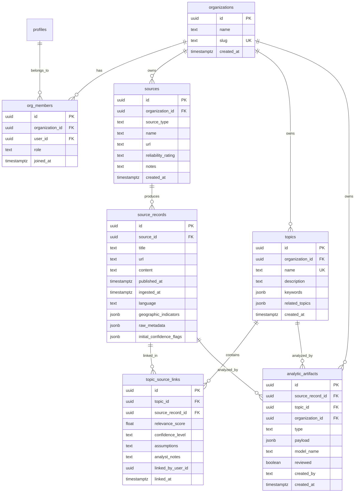

# Plan 1: OSINT Data Model & Database Migrations

## Overview

Create a new set of OSINT-focused database tables **parallel to existing tables** with organization-based multi-tenancy. The current app remains fully functional while the new schema is built and seeded.

## Architecture




## Key Files

| Purpose | File Path ||---------|-----------|| Migration: Org & Sources | [`supabase/migrations/20250101000010_osint_organizations.sql`](supabase/migrations/20250101000010_osint_organizations.sql) || Migration: Records & Topics | [`supabase/migrations/20250101000011_osint_records_topics.sql`](supabase/migrations/20250101000011_osint_records_topics.sql) || Migration: Links & Artifacts | [`supabase/migrations/20250101000012_osint_links_artifacts.sql`](supabase/migrations/20250101000012_osint_links_artifacts.sql) || Migration: RLS Policies | [`supabase/migrations/20250101000013_osint_rls.sql`](supabase/migrations/20250101000013_osint_rls.sql) || TypeScript Types | [`src/types/osint.ts`](src/types/osint.ts) || Seed Script | [`supabase/seed_osint.sql`](supabase/seed_osint.sql) |

## Implementation Details

### 1. Organizations & Membership Table

New table to support team-based access:

```sql
-- organizations: Container for team/project data
CREATE TABLE public.organizations (
  id UUID PRIMARY KEY DEFAULT uuid_generate_v4(),
  name TEXT NOT NULL,
  slug TEXT UNIQUE NOT NULL,
  created_at TIMESTAMPTZ DEFAULT NOW(),
  updated_at TIMESTAMPTZ DEFAULT NOW()
);

-- org_members: Links users to organizations with roles
CREATE TABLE public.org_members (
  id UUID PRIMARY KEY DEFAULT uuid_generate_v4(),
  organization_id UUID NOT NULL REFERENCES organizations(id) ON DELETE CASCADE,
  user_id UUID NOT NULL REFERENCES profiles(id) ON DELETE CASCADE,
  role TEXT NOT NULL DEFAULT 'member' CHECK (role IN ('owner', 'admin', 'analyst', 'member')),
  joined_at TIMESTAMPTZ DEFAULT NOW(),
  UNIQUE(organization_id, user_id)
);
```


### 2. Sources Table

```sql
CREATE TYPE osint_source_type AS ENUM ('rss', 'api', 'email', 'manual');
CREATE TYPE reliability_rating AS ENUM ('HIGH', 'MEDIUM', 'LOW', 'UNKNOWN');

CREATE TABLE public.sources (
  id UUID PRIMARY KEY DEFAULT uuid_generate_v4(),
  organization_id UUID NOT NULL REFERENCES organizations(id) ON DELETE CASCADE,
  source_type osint_source_type NOT NULL,
  name TEXT NOT NULL,
  url TEXT,
  reliability_rating reliability_rating DEFAULT 'UNKNOWN',
  notes TEXT,
  created_at TIMESTAMPTZ DEFAULT NOW(),
  updated_at TIMESTAMPTZ DEFAULT NOW()
);
```


### 3. SourceRecords Table

```sql
CREATE TABLE public.source_records (
  id UUID PRIMARY KEY DEFAULT uuid_generate_v4(),
  source_id UUID NOT NULL REFERENCES sources(id) ON DELETE CASCADE,
  title TEXT NOT NULL,
  url TEXT,
  content TEXT,
  published_at TIMESTAMPTZ,
  ingested_at TIMESTAMPTZ DEFAULT NOW(),
  language TEXT,
  geographic_indicators JSONB,
  raw_metadata JSONB,
  initial_confidence_flags JSONB
);

-- Full-text search index
CREATE INDEX idx_source_records_search ON source_records 
  USING GIN(to_tsvector('english', title || ' ' || COALESCE(content, '')));
```


### 4. Topics Table (OSINT-specific)

```sql
CREATE TABLE public.osint_topics (
  id UUID PRIMARY KEY DEFAULT uuid_generate_v4(),
  organization_id UUID NOT NULL REFERENCES organizations(id) ON DELETE CASCADE,
  name TEXT NOT NULL,
  description TEXT,
  keywords JSONB DEFAULT '[]',
  related_topics JSONB DEFAULT '[]',
  created_at TIMESTAMPTZ DEFAULT NOW(),
  updated_at TIMESTAMPTZ DEFAULT NOW(),
  UNIQUE(organization_id, name)
);
```


### 5. TopicSourceLinks Table

```sql
CREATE TYPE confidence_level AS ENUM ('HIGH', 'MEDIUM', 'LOW');

CREATE TABLE public.topic_source_links (
  id UUID PRIMARY KEY DEFAULT uuid_generate_v4(),
  topic_id UUID NOT NULL REFERENCES osint_topics(id) ON DELETE CASCADE,
  source_record_id UUID NOT NULL REFERENCES source_records(id) ON DELETE CASCADE,
  relevance_score NUMERIC(4,3) CHECK (relevance_score >= 0 AND relevance_score <= 1),
  confidence_level confidence_level,
  assumptions TEXT,
  analyst_notes TEXT,
  linked_by_user_id UUID REFERENCES profiles(id),
  linked_at TIMESTAMPTZ DEFAULT NOW(),
  UNIQUE(topic_id, source_record_id)
);
```


### 6. AnalyticArtifacts Table

```sql
CREATE TYPE artifact_type AS ENUM (
  'summary', 'entity_extraction', 'tone_analysis', 
  'sentiment', 'key_facts', 'timeline', 'network_graph'
);

CREATE TABLE public.analytic_artifacts (
  id UUID PRIMARY KEY DEFAULT uuid_generate_v4(),
  source_record_id UUID REFERENCES source_records(id) ON DELETE SET NULL,
  topic_id UUID REFERENCES osint_topics(id) ON DELETE SET NULL,
  organization_id UUID NOT NULL REFERENCES organizations(id) ON DELETE CASCADE,
  type artifact_type NOT NULL,
  payload JSONB NOT NULL,
  model_name TEXT NOT NULL,
  reviewed BOOLEAN DEFAULT false,
  created_by TEXT NOT NULL,
  created_at TIMESTAMPTZ DEFAULT NOW()
);
```


### 7. TypeScript Types

Create [`src/types/osint.ts`](src/types/osint.ts) with interfaces matching the new schema:

```typescript
export type OsintSourceType = 'rss' | 'api' | 'email' | 'manual';
export type ReliabilityRating = 'HIGH' | 'MEDIUM' | 'LOW' | 'UNKNOWN';
export type ConfidenceLevel = 'HIGH' | 'MEDIUM' | 'LOW';
export type ArtifactType = 'summary' | 'entity_extraction' | 'tone_analysis' | ...;

export interface Organization { ... }
export interface OrgMember { ... }
export interface Source { ... }
export interface SourceRecord { ... }
export interface OsintTopic { ... }
export interface TopicSourceLink { ... }
export interface AnalyticArtifact { ... }
```


### 8. Seed Data (Non-Idempotent)

Simple INSERT statements for one-time seeding. Running twice will fail with duplicate key errors (by design - keeps it simple).Create sample data for testing:

- 1 organization ("OSINT Research Team")
- 2 sources (BBC World RSS, Reuters API)
- 5 source records (sample articles)
- 3 topics ("Climate Policy", "Tech Regulation", "Global Trade")
- Several topic-source links with relevance scores

To re-seed, manually delete data first:

```sql
-- Reset seed data (run before re-seeding)
TRUNCATE organizations CASCADE;
```


## Acceptance Criteria

- [ ] All 6 new tables exist in database with proper constraints
- [ ] Foreign key relationships work correctly (cascade deletes)
- [ ] Indexes created for common query patterns
- [ ] RLS policies allow org-member access only
- [ ] TypeScript types match database schema
- [ ] Seed data can be inserted and queried
- [ ] Existing app tables (`news_sources`, `news_articles`, etc.) remain untouched