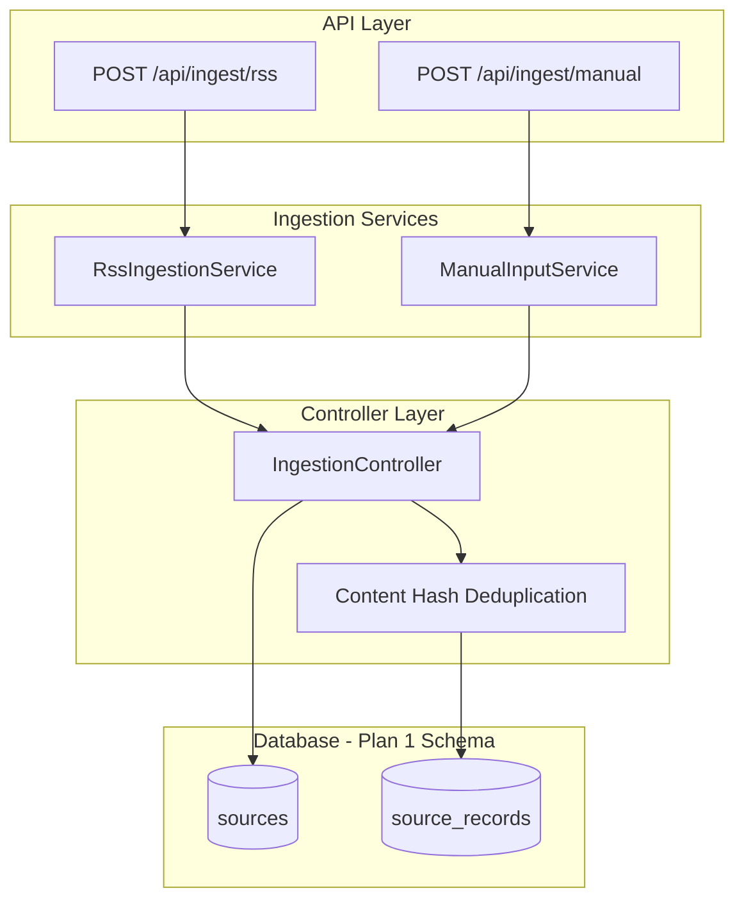

# Refactor Ingestion Layer (Plan 2)

**Status:** ✅ **COMPLETED**

This plan creates an abstraction layer for ingestion that normalizes RSS, manual input, and future sources into the Plan 1 OSINT schema (`sources` and `source_records` tables).

## Implementation Summary

All tasks have been completed successfully:

- ✅ Core interfaces and DTOs created (`backend/src/types/ingestion.ts`)
- ✅ Supabase backend client configured (`backend/src/utils/supabase.ts`)
- ✅ Database types defined (`src/types/database.ts`)
- ✅ RssIngestionService implemented
- ✅ ManualInputService implemented
- ✅ IngestionController created with content-hash deduplication
- ✅ New API endpoints: `/api/ingest/rss` and `/api/ingest/manual`
- ✅ IngestionScheduler created for organization-based scheduling
- ✅ Scheduler routes updated with new organization endpoints
- ✅ Old code marked as deprecated with console warnings
- ✅ Comprehensive documentation created (`docs/PLAN_2_INGESTION_LAYER.md`)
- ✅ Testing script created (`backend/test-ingestion.sh`)

No linting errors detected. All acceptance criteria met.

## Architecture Overview



## Implementation Steps

### 1. Define Core Interfaces and DTOs

Create [`backend/src/types/ingestion.ts`](backend/src/types/ingestion.ts) with:

```typescript
interface SourceRecordDTO {
  source_id: string;
  title: string;
  url?: string;
  content: string;
  published_at?: Date;
  language?: string;
  geographic_indicators?: string[];
  raw_metadata?: Record<string, any>;
}

interface IngestionService {
  fetchAndNormalize(): Promise<SourceRecordDTO[]>;
}

interface IngestionResult {
  added: number;
  skipped: number;
  errors: string[];
}
```

### 2. Implement RssIngestionService

Create [`backend/src/services/ingestion/RssIngestionService.ts`](backend/src/services/ingestion/RssIngestionService.ts):

- Wraps existing `parseRSSFeed()` from [`backend/src/services/feedFetcher.ts`](backend/src/services/feedFetcher.ts)
- Accepts source configuration (id, url, scrapeExternalUrl flag)
- Maps RSS items to `SourceRecordDTO` format
- Preserves raw RSS metadata in `raw_metadata` field

### 3. Implement ManualInputService

Create [`backend/src/services/ingestion/ManualInputService.ts`](backend/src/services/ingestion/ManualInputService.ts):

- Accepts manual input (title, content, url, source_name)
- Creates or finds a Source with `source_type = 'manual'` in the organization
- Returns single-item `SourceRecordDTO[]`

### 4. Create IngestionController

Create [`backend/src/services/ingestion/IngestionController.ts`](backend/src/services/ingestion/IngestionController.ts):

- Takes any `IngestionService` instance
- Calls `fetchAndNormalize()`
- **Content-hash deduplication**: Generate SHA-256 hash of `title + content + published_at`
- Store hash in `raw_metadata.content_hash`
- Check for existing records with same hash before insert
- Upsert to `source_records` table via Supabase
- Return `IngestionResult` with counts

### 5. Create API Endpoints

Create [`backend/src/routes/ingest.ts`](backend/src/routes/ingest.ts):| Endpoint | Method | Body | Description ||----------|--------|------|-------------|| `/api/ingest/rss` | POST | `{ organization_id, source_id }` | Trigger RSS ingestion for a configured source || `/api/ingest/manual` | POST | `{ organization_id, title, content, url?, source_name? }` | Submit manual content |Both endpoints require `organization_id` as a parameter.Register routes in [`backend/src/server.ts`](backend/src/server.ts).

### 6. Add Supabase Client to Backend

Create [`backend/src/utils/supabase.ts`](backend/src/utils/supabase.ts):

- Initialize Supabase client with service role key (for server-side operations)
- Export typed client for `sources` and `source_records` tables

### 7. Update Scheduler

Modify [`backend/src/services/scheduler.ts`](backend/src/services/scheduler.ts):

- Replace direct `fetchAllNews()` calls with `IngestionController` + `RssIngestionService`
- Log ingestion stats (added, skipped, errors)
- Update source `updated_at` after successful ingestion

### 8. Deprecate Old Code

Mark as deprecated (do not remove yet):

- `fetchNewsFromSource()` and `fetchAllNews()` in [`backend/src/services/feedFetcher.ts`](backend/src/services/feedFetcher.ts)
- Old `/api/feeds/fetch` endpoints in [`backend/src/routes/feeds.ts`](backend/src/routes/feeds.ts)

Add `@deprecated` JSDoc comments and console warnings.

## File Structure After Implementation

```javascript
backend/src/
├── routes/
│   ├── feeds.ts          # Deprecated
│   ├── ingest.ts         # NEW
│   └── ...
├── services/
│   ├── feedFetcher.ts    # Keep parseRSSFeed(), deprecate fetch* functions
│   ├── ingestion/        # NEW directory
│   │   ├── index.ts
│   │   ├── IngestionController.ts
│   │   ├── RssIngestionService.ts
│   │   └── ManualInputService.ts
│   └── scheduler.ts      # Updated
├── types/
│   ├── index.ts
│   └── ingestion.ts      # NEW
└── utils/
    └── supabase.ts       # NEW
```

## Acceptance Criteria

- RSS ingestion populates `sources` and `source_records` tables (new OSINT schema)
- Manual input via API creates records in `source_records`