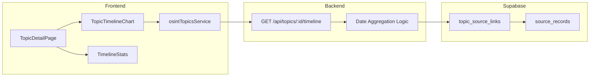

# Plan 4: Temporal Analysis & Timeline Visualization

## Architecture Overview




## Implementation Tasks

### 1. Backend: Timeline Endpoint

Add new route handler in [`backend/src/routes/topics.ts`](backend/src/routes/topics.ts):**Endpoint**: `GET /api/topics/:id/timeline`**Query Parameters**:

- `bucket`: `day` | `week` | `month` (default: `day`)
- `start_date`: ISO date string (optional)
- `end_date`: ISO date string (optional)

**Response Shape**:

```typescript
{
  topic_id: string;
  timeline: Array<{ date: string; count: number }>;
  first_mention: string | null;  // ISO timestamp
  total_records: number;
  velocity: {
    last_7_days: number;
    previous_7_days: number;
  };
}
```

**Aggregation Logic** (SQL):

- Join `topic_source_links` with `source_records` on `source_record_id`
- Group by `DATE_TRUNC(bucket, published_at)` 
- Use `COALESCE(published_at, ingested_at)` as the date field
- Calculate first mention as `MIN(published_at)`
- Velocity: count records where date is within last 7 days vs previous 7 days

### 2. Frontend: Install Chart.js

Add dependencies to [`package.json`](package.json):

- `chart.js` - Core charting library
- `react-chartjs-2` - React wrapper

### 3. Frontend: TypeScript Types

Add timeline types to [`src/types/osint.ts`](src/types/osint.ts):

```typescript
interface TimelineBucket {
  date: string;
  count: number;
}

interface TopicTimeline {
  topicId: string;
  timeline: TimelineBucket[];
  firstMention: Date | null;
  totalRecords: number;
  velocity: {
    last7Days: number;
    previous7Days: number;
  };
}
```


### 4. Frontend: Service Method

Add `getTimeline()` to [`src/services/osintTopics.service.ts`](src/services/osintTopics.service.ts):

```typescript
async getTimeline(
  topicId: string,
  options?: {
    bucket?: 'day' | 'week' | 'month';
    startDate?: string;
    endDate?: string;
  }
): Promise<TopicTimeline>
```


### 5. Frontend: Timeline Chart Component

Create new component `src/components/Topics/TopicTimelineChart.tsx`:

- Use Chart.js `Bar` or `Line` chart
- X-axis: dates from timeline data
- Y-axis: count of source records
- Mark first mention date with annotation or visual indicator
- Match existing dark theme (stone-900 backgrounds, stone-400 text)
- Include bucket size selector (day/week/month)

### 6. Frontend: Timeline Stats Component

Create `src/components/Topics/TimelineStats.tsx`:Display summary box with:

- First mention date (formatted)
- Total linked records
- Velocity indicator with percentage change (e.g., "+100% vs previous 7 days")
- Use color coding: green for increase, red for decrease, gray for no change

### 7. Frontend: Integrate into Topic Detail Page

Update [`src/components/Topics/TopicDetailPage.tsx`](src/components/Topics/TopicDetailPage.tsx):

- Add new section between topic header and linked records table
- Fetch timeline data on page load
- Render `TimelineStats` and `TopicTimelineChart` components
- Handle loading and error states

## Files to Create/Modify

| File | Action | Description |

|------|--------|-------------|

| `backend/src/routes/topics.ts` | Modify | Add timeline endpoint |

| `package.json` | Modify | Add chart.js dependencies |

| `src/types/osint.ts` | Modify | Add timeline types |

| `src/services/osintTopics.service.ts` | Modify | Add getTimeline method |

| `src/components/Topics/TopicTimelineChart.tsx` | Create | Chart.js timeline visualization |

| `src/components/Topics/TimelineStats.tsx` | Create | Summary stats component |

| `src/components/Topics/TopicDetailPage.tsx` | Modify | Integrate timeline section |

## Acceptance Criteria

- Timeline endpoint returns correctly aggregated data grouped by bucket
- First mention is accurately identified as earliest `published_at`
- Velocity calculates comparison between last 7 days and previous 7 days
- Chart renders on topic detail page with responsive sizing
- Bucket size can be changed via UI control
- Date range filtering works via API (UI controls optional)