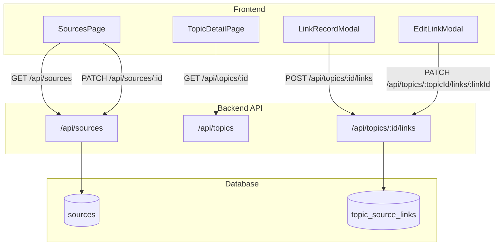

# Source Credibility & Confidence Framework

## Current State Analysis

The database schema already supports this feature:

- `sources` table has `reliability_rating` (HIGH/MEDIUM/LOW/UNKNOWN)
- `topic_source_links` has `confidence_level`, `assumptions`, `analyst_notes`, `relevance_score`

However, the APIs and UI need enhancement:

- The backend `/api/sources` route only has a `/test` endpoint (no CRUD for OSINT sources)
- No PATCH endpoint exists for updating topic-source links
- The LinkRecordModal is missing the assumptions field
- No confidence summary stats exist on Topic detail page
- No dedicated OSINT sources management page

## Implementation Plan

### 1. Backend: OSINT Sources API

Expand [`backend/src/routes/sources.ts`](backend/src/routes/sources.ts) to add:**GET /api/sources** - List all sources for an organization

- Query params: `organization_id` (required)
- Returns sources with reliability_rating and record counts
- Join to `source_records` for count aggregation

**PATCH /api/sources/:id** - Update source (including reliability_rating)

- Body: `{ name?, url?, reliability_rating?, notes? }`
- Validate reliability_rating against enum

### 2. Backend: Topic Links PATCH Endpoint

Add to [`backend/src/routes/topics.ts`](backend/src/routes/topics.ts):**PATCH /api/topics/:topicId/links/:linkId** - Update a topic-source link

- Body: `{ relevance_score?, confidence_level?, assumptions?, analyst_notes? }`
- Returns updated link

### 3. Frontend: OSINT Sources Service

Create [`src/services/osintSources.service.ts`](src/services/osintSources.service.ts):

- `getAll(organizationId)` - fetch sources with record counts
- `update(sourceId, updates)` - update source including reliability

### 4. Frontend: Sources Management Page

Redesign [`src/components/Sources/SourcesPage.tsx`](src/components/Sources/SourcesPage.tsx) to show OSINT sources:

```javascript
Table Columns:
| Name | Type | Reliability | Record Count | Notes | Actions |
```

Components to create/update:

- `OsintSourcesTable.tsx` - Table displaying all OSINT sources
- `EditSourceModal.tsx` - Modal for editing source (reliability dropdown, notes textarea)

### 5. Frontend: Link Record Modal - Add Assumptions

Update [`src/components/Topics/LinkRecordModal.tsx`](src/components/Topics/LinkRecordModal.tsx):

- Add textarea field for "Assumptions" with helper text: "What assumptions underlie this link?"
- Pass assumptions to the API when linking

### 6. Frontend: osintTopics Service - Add updateLink

Update [`src/services/osintTopics.service.ts`](src/services/osintTopics.service.ts):

- Add `updateLink(topicId, linkId, updates)` method for PATCH calls

### 7. Frontend: ConfidenceBadge Component

Create [`src/components/UI/ConfidenceBadge.tsx`](src/components/UI/ConfidenceBadge.tsx):

- Color-coded badge (green=HIGH, yellow=MEDIUM, red/orange=LOW)
- Hover tooltip showing assumptions text
- Reusable across LinkedRecordsTable and elsewhere

### 8. Frontend: Confidence Summary Stats

Update [`src/components/Topics/TopicDetailPage.tsx`](src/components/Topics/TopicDetailPage.tsx):

- Add stats box above linked records section showing:
- Count of HIGH/MEDIUM/LOW confidence links
- Percentage breakdown visualization

Create [`src/components/Topics/ConfidenceStats.tsx`](src/components/Topics/ConfidenceStats.tsx):

- Displays confidence distribution
- Uses ConfidenceBadge for visual consistency

### 9. Frontend: LinkedRecordsTable Enhancements

Update [`src/components/Topics/LinkedRecordsTable.tsx`](src/components/Topics/LinkedRecordsTable.tsx):

- Use new ConfidenceBadge component
- Display assumptions via tooltip/expandable
- Add inline edit capability or link to edit modal

### 10. Frontend: Edit Link Modal

Create [`src/components/Topics/EditLinkModal.tsx`](src/components/Topics/EditLinkModal.tsx):

- Modal for editing an existing link's metadata
- Fields: confidence level, relevance score, assumptions, analyst notes
- Calls PATCH API to update

---

## File Changes Summary

| File | Action ||------|--------|| `backend/src/routes/sources.ts` | Expand with GET/ and PATCH/:id || `backend/src/routes/topics.ts` | Add PATCH /:topicId/links/:linkId || `src/services/osintSources.service.ts` | Create new service || `src/services/osintTopics.service.ts` | Add updateLink method || `src/services/index.ts` | Export new service || `src/components/UI/ConfidenceBadge.tsx` | Create reusable component || `src/components/Sources/SourcesPage.tsx` | Redesign for OSINT sources || `src/components/Sources/OsintSourcesTable.tsx` | Create table component || `src/components/Sources/EditSourceModal.tsx` | Create edit modal || `src/components/Topics/LinkRecordModal.tsx` | Add assumptions field || `src/components/Topics/LinkedRecordsTable.tsx` | Use ConfidenceBadge, show assumptions || `src/components/Topics/ConfidenceStats.tsx` | Create stats component || `src/components/Topics/EditLinkModal.tsx` | Create edit link modal || `src/components/Topics/TopicDetailPage.tsx` | Add ConfidenceStats section |---

## Data Flow

