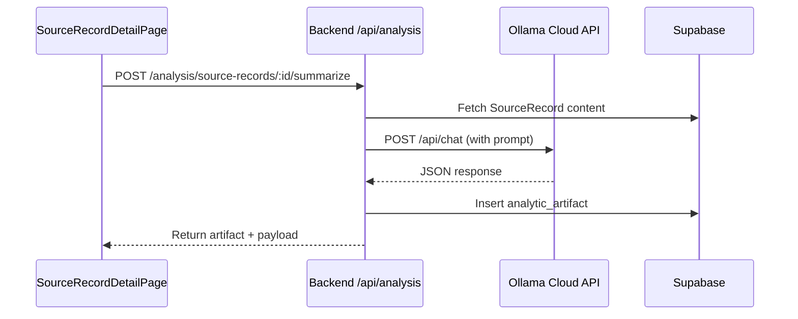

# Plan 6: Controlled Ollama Cloud Integration ✅ COMPLETE

## Overview

Integrate Ollama Cloud API (`https://ollama.com/api`) as an analysis assistant for SourceRecords. AI outputs are stored in `analytic_artifacts` and labeled as requiring human verification.**Status**: ✅ Implementation CompleteAll acceptance criteria met. See [PLAN_6_OLLAMA_INTEGRATION_COMPLETE.md](../../docs/PLAN_6_OLLAMA_INTEGRATION_COMPLETE.md) for detailed implementation summary.

## Architecture

