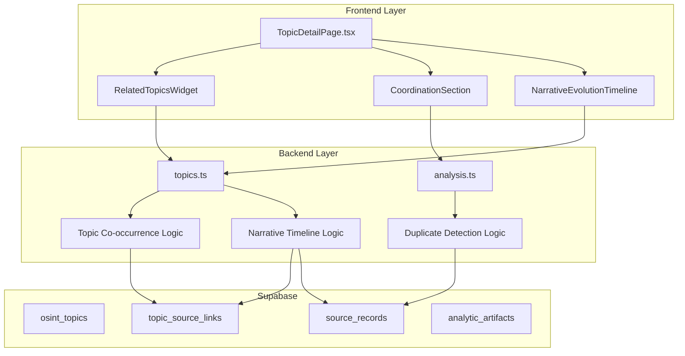

# Plan 7: Correlation, Co-Occurrence, and Coordination Detection

This plan adds pattern recognition capabilities to the OSINT platform: topic co-occurrence analysis, near-duplicate content detection, and narrative evolution tracking.

## Architecture Overview




## Implementation Tasks

### 1. Backend: Topic Co-occurrence Endpoint

**File:** [`backend/src/routes/topics.ts`](backend/src/routes/topics.ts)Add `GET /api/topics/:id/related` route:

- Query all source records linked to this topic via `topic_source_links`
- For each other topic, count shared source records
- Calculate Jaccard similarity: `|A intersection B| / |A union B|`
- Return sorted list of related topics with similarity scores

**Response shape:**

```json
{
  "topic_id": "uuid",
  "related_topics": [
    {"topic_id": "uuid", "name": "...", "shared_records": 12, "similarity_score": 0.45}
  ]
}
```


### 2. Backend: Near-Duplicate Detection Endpoint

**File:** [`backend/src/routes/analysis.ts`](backend/src/routes/analysis.ts)Add `POST /api/analysis/detect-duplicates` route:

- Accept optional `{topic_id: "..."}` in body (null = global scan)
- Fetch source records (filtered by topic if provided)
- Compare text similarity using normalized title/content hashing (simple approach: first 200 chars normalized)
- Group records with similarity > 0.8 threshold
- Return duplicate groups with timestamps for coordination analysis

**Response shape:**

```json
{
  "duplicate_groups": [
    {
      "representative_id": "uuid",
      "records": [{"id": "...", "title": "...", "source_name": "...", "published_at": "..."}],
      "similarity": 0.92,
      "tight_window": true
    }
  ]
}
```


### 3. Backend: Narrative Evolution Endpoint

**File:** [`backend/src/routes/topics.ts`](backend/src/routes/topics.ts)Add `GET /api/topics/:id/narrative-timeline` route:

- Query params: `bucket` (day|week|month), `start_date`, `end_date`
- For each time bucket, aggregate source record titles
- Extract key phrases (simple: most frequent 2-3 word phrases)
- Return timeline with phrase summaries per period

**Response shape:**

```json
{
  "topic_id": "uuid",
  "buckets": [
    {"date": "2025-01-01", "record_count": 5, "key_phrases": ["phrase1", "phrase2"]}
  ]
}
```


### 4. Database: Extend artifact_type Enum

**File:** New migration `supabase/migrations/20250102000001_coordination_artifact_type.sql`Add `'coordination_check'` to `artifact_type` enum to store analyst coordination assessments.

### 5. Backend: Save Coordination Assessment

**File:** [`backend/src/routes/analysis.ts`](backend/src/routes/analysis.ts)Add `POST /api/analysis/coordination-assessments` route:

- Body: `{duplicate_group_hash, assessment, assessed_by_user_id}`
- Store as `analytic_artifact` with `type='coordination_check'`

### 6. Frontend: Types for New Features

**File:** [`src/types/osint.ts`](src/types/osint.ts)Add interfaces:

- `RelatedTopic`: topic co-occurrence result
- `DuplicateGroup`: near-duplicate detection result
- `NarrativeBucket`: narrative timeline bucket

### 7. Frontend: Service Methods

**File:** [`src/services/osintTopics.service.ts`](src/services/osintTopics.service.ts)Add methods:

- `getRelatedTopics(topicId)` - calls `/api/topics/:id/related`
- `getNarrativeTimeline(topicId, options)` - calls `/api/topics/:id/narrative-timeline`

**File:** [`src/services/analysis.service.ts`](src/services/analysis.service.ts)Add methods:

- `detectDuplicates(topicId?)` - calls `/api/analysis/detect-duplicates`
- `saveCoordinationAssessment(groupHash, assessment)` - saves analyst notes

### 8. Frontend: Related Topics Widget

**File:** New `src/components/Topics/RelatedTopicsWidget.tsx`

- Fetch related topics on mount
- Display list with similarity scores (percentage)
- Click navigates to related topic
- Optional: Simple network visualization using d3-force or similar

### 9. Frontend: Coordination Detection Section

**File:** New `src/components/Topics/CoordinationSection.tsx`

- "Detect Near-Duplicates" button
- On click: loading state, then display grouped results
- Each group shows:
- List of titles with source names
- Publication timestamps
- Highlight if published within 1 hour (tight window)
- Textarea for analyst notes with save button

### 10. Frontend: Narrative Evolution Timeline

**File:** New `src/components/Topics/NarrativeEvolutionTimeline.tsx`

- Fetch narrative timeline on mount
- Render expandable timeline sections (one per bucket)
- Each section shows date range, record count, key phrases
- Uses existing bucket selector pattern from `TopicTimelineChart`

### 11. Frontend: Integrate into TopicDetailPage

**File:** [`src/components/Topics/TopicDetailPage.tsx`](src/components/Topics/TopicDetailPage.tsx)Add three new sections:

1. Related Topics section (after keywords)
2. Coordination Detection section (new section after Confidence Assessment)
3. Narrative Evolution section (integrate with existing Temporal Analysis)

## Key Files to Modify

| File | Changes ||------|---------|| `backend/src/routes/topics.ts` | Add `/related` and `/narrative-timeline` endpoints || `backend/src/routes/analysis.ts` | Add `/detect-duplicates` and `/coordination-assessments` endpoints || `src/types/osint.ts` | Add new type interfaces || `src/services/osintTopics.service.ts` | Add service methods for new endpoints || `src/services/analysis.service.ts` | Add duplicate detection and assessment methods || `src/components/Topics/TopicDetailPage.tsx` | Integrate new sections || New: `src/components/Topics/RelatedTopicsWidget.tsx` | Related topics display || New: `src/components/Topics/CoordinationSection.tsx` | Duplicate detection UI || New: `src/components/Topics/NarrativeEvolutionTimeline.tsx` | Narrative timeline UI || New: `supabase/migrations/20250102000001_coordination_artifact_type.sql` | DB enum extension |

## Similarity Algorithm Notes

For near-duplicate detection, implement a simple approach first:

1. Normalize text: lowercase, remove punctuation, collapse whitespace
2. Use first 200 characters of normalized title+content as fingerprint