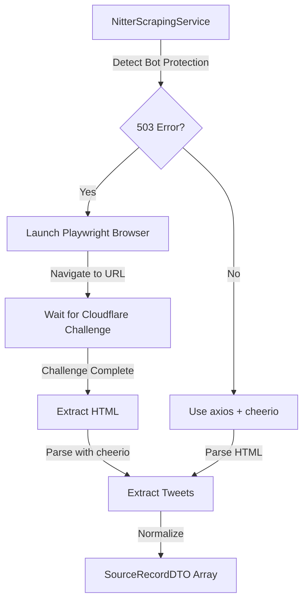

# Playwright Integration for Nitter Scraping

## Overview

This plan implements Playwright headless browser automation to bypass Cloudflare bot protection when scraping Nitter instances. This replaces the current axios + cheerio approach that fails on protected instances (503 errors with "Verifying your browser" challenges).

## Vercel Plan Recommendation

### Recommendation: **Upgrade to Vercel Pro ($20/month)**

**Critical Reasons:**

1. **Execution Timeout Limits**:

- **Hobby**: 10 seconds maximum
- **Pro**: 60 seconds maximum
- **Impact**: Playwright scraping takes 3-8 seconds (browser launch + page load + Cloudflare challenge). With Hobby's 10-second limit, requests may timeout if Cloudflare challenges take longer or there are network delays.

2. **Resource Consumption**:

- **Hobby**: 100 GB-hours function duration/month, 4 CPU-hours/month
- **Pro**: 1,000 GB-hours function duration/month, 16 CPU-hours/month
- **Impact**: Playwright is resource-intensive (~200-400MB memory, CPU during browser launch). Pro's 4x higher limits provide headroom for production usage.

3. **Included Usage Credit**:

- Pro includes $20/month usage credit that applies to all infrastructure resources
- This effectively offsets the base $20/month cost for moderate usage
- Additional usage billed at: $0.128/hour (Active CPU), $0.0106/GB-hour (Memory)

4. **Production Readiness**:

- Better concurrency (12 concurrent builds vs 1)
- More generous function invocation limits (10M vs 1M)
- Advanced spend management and monitoring tools

**Cost Analysis:**

- **Hobby**: Free, but likely insufficient for Playwright
- **Pro**: $20/month + $20 usage credit = effectively $0-20/month depending on usage
- **Break-even**: If you use less than $20 in additional resources, Pro costs $0 net

**Alternative for Hobby Users:**

If staying on Hobby, consider using an external browser service (Browserless.io, ScrapingBee) which offloads browser management but adds $49-99/month cost - making Pro the better value.

## Architecture




## Implementation Steps

### Phase 1: Setup & Dependencies (1-2 hours)

**Files to Modify:**

- `backend/package.json` - Add Playwright dependency
- `.vercelignore` (create if needed) - Exclude unnecessary files from deployment

**Actions:**

1. Install Playwright:
   ```bash
      cd backend
      npm install playwright@latest
      npx playwright install chromium
   ```


2. Update `backend/package.json`:
   ```json
      {
        "dependencies": {
          "playwright": "^1.48.0"
        },
        "scripts": {
          "postinstall": "playwright install chromium"
        }
      }
   ```


3. Configure Vercel for larger functions:

- Create/update `vercel.json` to specify function configuration
- Set maxDuration for ingestion routes (requires Pro plan)

### Phase 2: Update NitterScrapingService (3-4 hours)

**File:** `backend/src/services/ingestion/NitterScrapingService.ts`**Changes:**

1. Add Playwright import and browser management
2. Implement fallback logic:

- Try axios first (fast path for unprotected instances)
- If 503/bot protection detected, use Playwright

3. Browser lifecycle management:

- Launch browser with optimized args
- Create context with realistic fingerprint
- Navigate and wait for content
- Extract HTML and close browser

4. Error handling:

- Timeout handling (fail fast if challenge takes too long)
- Browser cleanup on errors
- Fallback to error message if all fails

**Key Implementation Details:**

```typescript
// Browser launch args for Cloudflare evasion
const browser = await chromium.launch({
  headless: true,
  args: [
    '--disable-blink-features=AutomationControlled',
    '--disable-dev-shm-usage',
    '--no-sandbox',
    '--disable-setuid-sandbox',
    '--disable-web-security',
  ],
});

// Context with realistic fingerprint
const context = await browser.newContext({
  userAgent: 'Mozilla/5.0 (Windows NT 10.0; Win64; x64) AppleWebKit/537.36...',
  viewport: { width: 1920, height: 1080 },
  locale: 'en-US',
  timezoneId: 'America/New_York',
});

// Wait for Cloudflare challenge to complete
await page.goto(url, { waitUntil: 'networkidle', timeout: 30000 });
await page.waitForSelector('.timeline-item', { timeout: 15000 });
```


### Phase 3: Vercel Configuration (1 hour)

**File:** `vercel.json`**Updates:**

1. Add function configuration for ingestion routes:
   ```json
      {
        "functions": {
          "api/ingest/**": {
            "maxDuration": 60,
            "memory": 1024
          }
        }
      }
   ```


2. Ensure Playwright binaries are included in deployment:

- Vercel automatically includes `node_modules`
- Playwright binaries in `node_modules/.cache/playwright` should be included
- May need to verify deployment size

### Phase 4: Testing & Optimization (2-3 hours)

**Testing Checklist:**

1. Test with protected Nitter instance (nitter.poast.org)
2. Test with unprotected Nitter instance (should use fast axios path)
3. Test timeout handling (simulate slow Cloudflare challenge)
4. Test error handling (network failures, invalid URLs)
5. Monitor resource usage in Vercel dashboard
6. Test cold start performance

**Optimization:**

1. Browser launch args tuning
2. Timeout values optimization
3. Memory usage monitoring
4. Consider browser reuse if using persistent server (not applicable to serverless)

### Phase 5: Monitoring & Hardening (1-2 hours)

**Monitoring:**

1. Add logging for Playwright usage vs axios usage
2. Track success rates for protected vs unprotected instances
3. Monitor execution times and resource usage
4. Set up alerts for high failure rates

**Hardening:**

1. Add retry logic with exponential backoff
2. Implement rate limiting per Nitter instance
3. Add caching for successful scrapes
4. Graceful degradation (fallback to error if Playwright fails)

## Technical Considerations

### Browser Binary Size

- **Chromium only**: ~100MB
- **All browsers**: ~300MB
- **Recommendation**: Install only Chromium to minimize deployment size
- **Vercel Limit**: No hard limit on function size, but larger functions have slower cold starts

### Memory Usage

- **Browser launch**: ~200-400MB peak
- **Vercel Limit**: 1024MB (both Hobby and Pro)
- **Recommendation**: Monitor usage, optimize browser args if needed

### Cold Start Impact

- **Current (axios)**: ~200ms
- **With Playwright**: ~2-5 seconds (browser launch)
- **Mitigation**: 
- Keep browser launch args minimal
- Use single browser (Chromium only)
- Consider warming functions for critical paths

### Execution Time

- **Typical scraping**: 3-8 seconds
- **Hobby limit**: 10 seconds (too tight)
- **Pro limit**: 60 seconds (comfortable margin)
- **Recommendation**: Set timeout to 30 seconds, fail fast if Cloudflare challenge takes too long

## Error Handling Strategy

1. **Try Fast Path First**: Use axios for unprotected instances
2. **Detect Bot Protection**: Check for 503 or challenge page content
3. **Fallback to Playwright**: Launch browser only when needed
4. **Timeout Management**: Fail fast if challenge takes > 30 seconds
5. **Graceful Degradation**: Return clear error if all methods fail
6. **Browser Cleanup**: Always close browser, even on errors

## Cost Estimation

### Vercel Pro ($20/month)

**Base Cost**: $20/month

**Included Credit**: $20/month

**Net Cost**: $0-20/month depending on usage**Usage Scenarios:**

- **Light usage** (100 scrapes/month): ~$0-5 additional
- **Moderate usage** (1,000 scrapes/month): ~$5-15 additional
- **Heavy usage** (10,000 scrapes/month): ~$15-30 additional

**Total Monthly Cost**: $20-50 depending on usage

### Alternative: External Browser Service

- **Browserless.io**: $75/month (unlimited)
- **ScrapingBee**: $49/month (100k requests)
- **ScraperAPI**: $99/month (unlimited)

**Verdict**: Pro plan is more cost-effective for moderate usage

## Success Criteria

1. ✅ Successfully bypasses Cloudflare protection on protected Nitter instances
2. ✅ Maintains fast path (axios) for unprotected instances
3. ✅ Execution time stays under 30 seconds for typical requests
4. ✅ Memory usage stays under 1024MB limit
5. ✅ Error handling provides clear feedback
6. ✅ Monitoring shows success rates > 90% for protected instances

## Risk Mitigation

1. **Cloudflare Updates**: Monitor success rates, update browser args as needed
2. **Rate Limiting**: Implement delays between requests, respect robots.txt
3. **IP Blocking**: Consider proxy rotation if needed (future enhancement)
4. **Serverless Limitations**: Monitor cold starts, consider external service if needed
5. **Cost Overruns**: Set up Vercel spend alerts, use included $20 credit wisely

## Files to Create/Modify

1. `backend/package.json` - Add Playwright dependency
2. `backend/src/services/ingestion/NitterScrapingService.ts` - Add Playwright integration
3. `vercel.json` - Configure function limits
4. `.vercelignore` (optional) - Exclude unnecessary files

## Dependencies

- `playwright@^1.48.0` (latest stable)
- Chromium browser binary (~100MB)

## Timeline

- **Phase 1**: 1-2 hours
- **Phase 2**: 3-4 hours
- **Phase 3**: 1 hour
- **Phase 4**: 2-3 hours
- **Phase 5**: 1-2 hours
- **Total**: 8-12 hours

## Next Steps After Implementation

1. Monitor success rates and performance
2. Optimize browser args based on real-world usage
3. Consider browser reuse if moving to persistent server
4. Evaluate external browser service if serverless proves too limiting