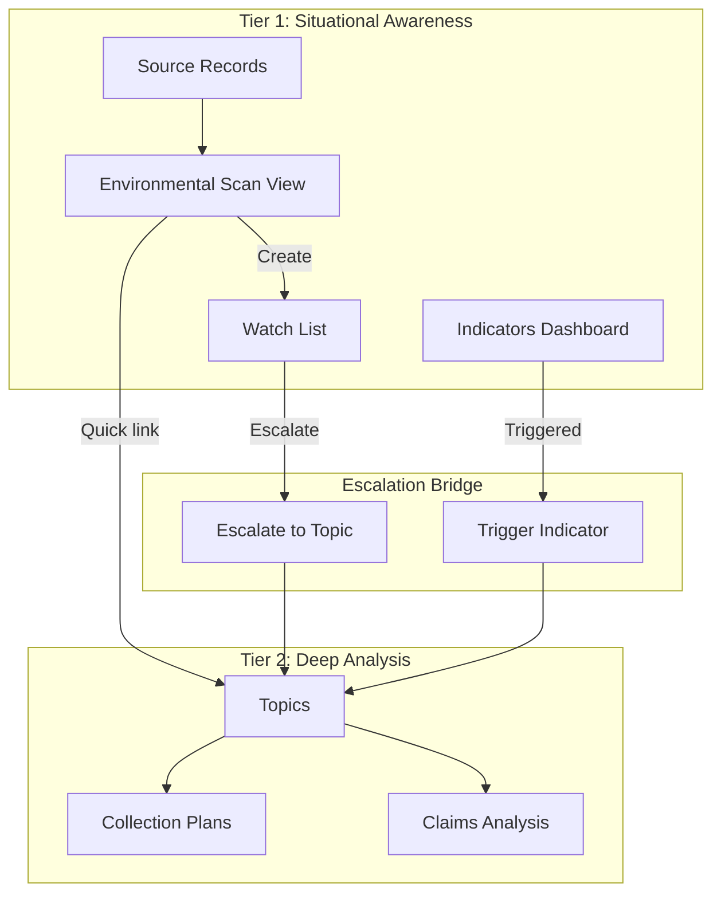
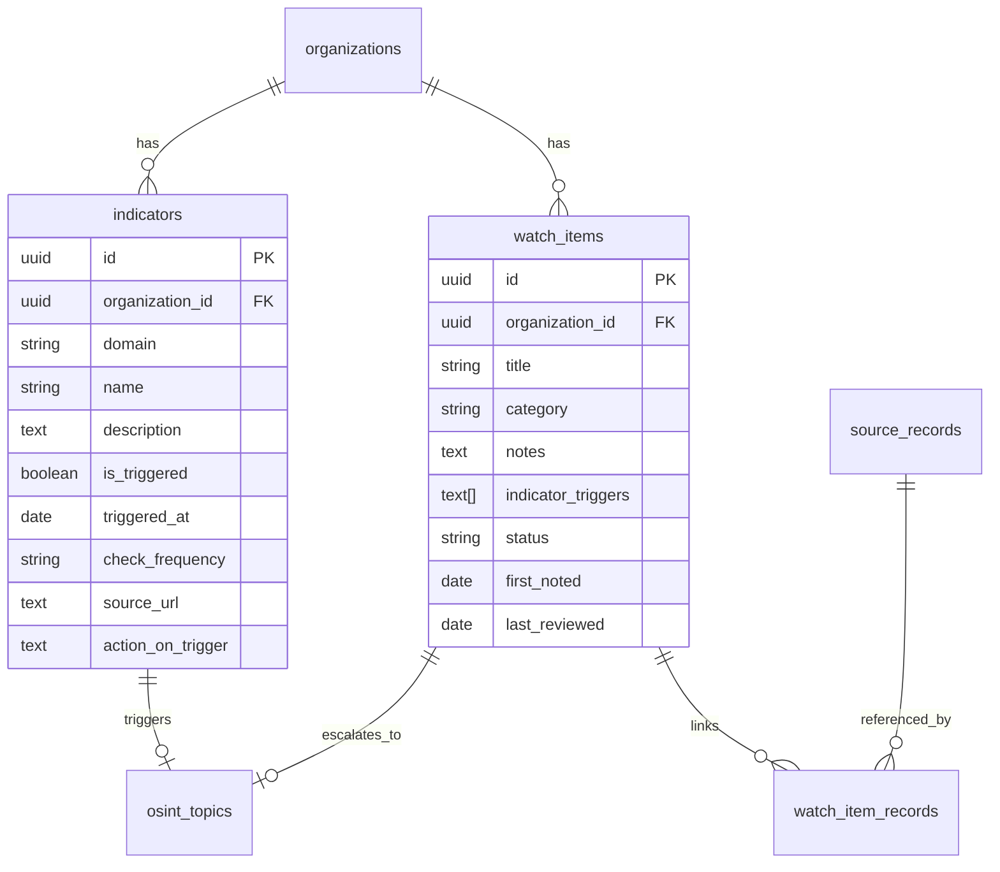
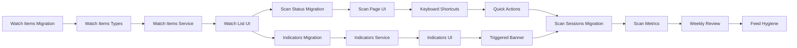

# Two-Tier Intelligence Model Implementation

Implement the situational awareness layer (Tier 1) to complement the existing deep analysis workflow (Tier 2/Topics). This extends the current OSINT Workflow Enhancement plan as Phases 5-8.

## Architecture Overview




## Data Model



---

## Phase 5: Watch Items Foundation

**Goal**: Create the Watch List entity as the bridge between scanning and deep analysis.

### Database Migration

Create [`supabase/migrations/20250105000001_watch_items.sql`](supabase/migrations/20250105000001_watch_items.sql):

```sql
-- Watch item status enum
CREATE TYPE watch_item_status AS ENUM ('watching', 'escalated', 'archived');

-- Watch item category enum  
CREATE TYPE watch_item_category AS ENUM (
  'politics', 'finance', 'technology', 'local', 
  'international', 'health', 'security', 'other'
);

-- Main watch_items table
CREATE TABLE watch_items (
  id UUID PRIMARY KEY DEFAULT gen_random_uuid(),
  organization_id UUID NOT NULL REFERENCES organizations(id),
  title TEXT NOT NULL,
  category watch_item_category NOT NULL DEFAULT 'other',
  notes TEXT,
  indicator_triggers TEXT[], -- What would escalate this?
  status watch_item_status NOT NULL DEFAULT 'watching',
  escalated_topic_id UUID REFERENCES osint_topics(id),
  first_noted_at TIMESTAMPTZ DEFAULT now(),
  last_reviewed_at TIMESTAMPTZ DEFAULT now(),
  created_at TIMESTAMPTZ DEFAULT now(),
  updated_at TIMESTAMPTZ DEFAULT now()
);

-- Junction table for loosely linked source records
CREATE TABLE watch_item_records (
  id UUID PRIMARY KEY DEFAULT gen_random_uuid(),
  watch_item_id UUID NOT NULL REFERENCES watch_items(id) ON DELETE CASCADE,
  source_record_id UUID NOT NULL REFERENCES source_records(id) ON DELETE CASCADE,
  linked_at TIMESTAMPTZ DEFAULT now(),
  UNIQUE(watch_item_id, source_record_id)
);
```


### Type Definitions

Update [`src/types/osint.ts`](src/types/osint.ts):

```typescript
export type WatchItemStatus = 'watching' | 'escalated' | 'archived';
export type WatchItemCategory = 'politics' | 'finance' | 'technology' | 
  'local' | 'international' | 'health' | 'security' | 'other';

export interface WatchItem {
  id: string;
  organizationId: string;
  title: string;
  category: WatchItemCategory;
  notes: string | null;
  indicatorTriggers: string[];
  status: WatchItemStatus;
  escalatedTopicId: string | null;
  firstNotedAt: Date;
  lastReviewedAt: Date;
  // Computed
  signalCount?: number;
}
```


### Service Layer

Create [`src/services/watchItems.service.ts`](src/services/watchItems.service.ts):

- `getWatchItems(orgId, filters)` - List with category/status filtering
- `createWatchItem(item)` - Create new watch item
- `updateWatchItem(id, updates)` - Update item
- `archiveWatchItem(id)` - Mark as archived
- `escalateToTopic(watchItemId, topicData)` - Create topic from watch item
- `linkRecord(watchItemId, recordId)` - Associate source record
- `getSignalCount(watchItemId)` - Count linked records

### UI Components

Create [`src/components/WatchList/`](src/components/WatchList/) directory:| Component | Purpose ||-----------|---------|| `WatchListPage.tsx` | Main `/watch-list` route || `WatchItemCard.tsx` | Individual item display || `WatchItemForm.tsx` | Create/edit form || `EscalateToTopicModal.tsx` | Convert to full topic |---

## Phase 6: Environmental Scan View

**Goal**: Fast triage interface for processing high-volume source records.

### New Route

Create [`src/components/Scan/ScanPage.tsx`](src/components/Scan/ScanPage.tsx) at `/scan`:**Layout** (3-column):

- Left sidebar: Domain filter (category-based feed groups)
- Main panel: Unread/untriaged source records (headline + first line)
- Right sidebar: Quick actions panel

**Features**:

- Scan mode toggle (shows only untriaged records)
- Keyboard shortcuts for rapid triage
- Batch dismiss functionality
- Time-boxing reminder (optional 20-min timer)

### Keyboard Shortcuts

| Key | Action ||-----|--------|| `j` / `k` | Navigate up/down through items || `t` | Link to existing topic (opens dropdown) || `w` | Create watch item from current record || `x` | Dismiss (mark as reviewed, remove from scan view) || `Enter` | Expand/collapse full content || `?` | Show keyboard shortcut help |

### Source Record Extensions

Add to [`src/types/osint.ts`](src/types/osint.ts):

```typescript
// Add to SourceRecord interface
export interface SourceRecord {
  // ... existing fields
  scanStatus: 'pending' | 'reviewed' | 'linked' | 'dismissed';
  reviewedAt: Date | null;
}
```

Database migration adds `scan_status` and `reviewed_at` columns to `source_records`.

### UI Components

| Component | Purpose ||-----------|---------|| `ScanPage.tsx` | Main scan interface || `ScanItem.tsx` | Individual record in scan view || `ScanSidebar.tsx` | Domain filters + stats || `QuickActionsPanel.tsx` | Right sidebar actions || `CreateWatchItemModal.tsx` | Fast watch item creation || `QuickLinkToTopicModal.tsx` | Fast topic linking |

### Domain-Based Feed Organization

Add `domain` field to sources for categorization:

```sql
ALTER TABLE sources ADD COLUMN domain watch_item_category;
```

This allows filtering scan view by domain (Politics, Finance, Tech, etc.).---

## Phase 7: Indicators & Warnings System

**Goal**: Predefined signals that trigger escalation to topics.

### Database Schema

Create [`supabase/migrations/20250105000002_indicators.sql`](supabase/migrations/20250105000002_indicators.sql):

```sql
CREATE TYPE indicator_check_frequency AS ENUM ('daily', 'weekly', 'monthly');

CREATE TABLE indicators (
  id UUID PRIMARY KEY DEFAULT gen_random_uuid(),
  organization_id UUID NOT NULL REFERENCES organizations(id),
  domain watch_item_category NOT NULL,
  name TEXT NOT NULL,
  description TEXT,
  source_url TEXT,
  check_frequency indicator_check_frequency DEFAULT 'weekly',
  is_triggered BOOLEAN DEFAULT false,
  triggered_at TIMESTAMPTZ,
  action_on_trigger TEXT, -- e.g., "Create topic: Recession Risk Assessment"
  last_checked_at TIMESTAMPTZ,
  created_at TIMESTAMPTZ DEFAULT now(),
  updated_at TIMESTAMPTZ DEFAULT now()
);

-- Link indicators to topics they created
ALTER TABLE indicators 
ADD COLUMN triggered_topic_id UUID REFERENCES osint_topics(id);
```


### Service Layer

Create [`src/services/indicators.service.ts`](src/services/indicators.service.ts):

- `getIndicators(orgId, domain?)` - List indicators
- `createIndicator(indicator)` - Create new indicator
- `updateIndicator(id, updates)` - Update indicator
- `triggerIndicator(id, topicId?)` - Mark as triggered
- `checkIndicator(id)` - Update last_checked_at
- `getDueForCheck(orgId)` - Get indicators needing review

### UI Components

Create [`src/components/Indicators/`](src/components/Indicators/) directory:| Component | Purpose ||-----------|---------|| `IndicatorsPage.tsx` | Main `/indicators` route || `IndicatorCard.tsx` | Single indicator display || `IndicatorForm.tsx` | Create/edit indicator || `IndicatorCheckModal.tsx` | Check-off workflow || `TriggeredIndicatorsBanner.tsx` | Alert for triggered indicators |

### Dashboard Integration

Add triggered indicators banner to:

- Header component (global notification)
- Scan page (context for scanning)
- Topics page (escalation context)

---

## Phase 8: Scan Workflow Integration

**Goal**: Complete the scanning workflow with logging, metrics, and review cadence.

### Scan Log / Decision Journal

Create [`supabase/migrations/20250105000003_scan_logs.sql`](supabase/migrations/20250105000003_scan_logs.sql):

```sql
CREATE TABLE scan_sessions (
  id UUID PRIMARY KEY DEFAULT gen_random_uuid(),
  organization_id UUID NOT NULL REFERENCES organizations(id),
  user_id UUID NOT NULL REFERENCES auth.users(id),
  started_at TIMESTAMPTZ DEFAULT now(),
  ended_at TIMESTAMPTZ,
  items_reviewed INTEGER DEFAULT 0,
  items_linked_to_topics INTEGER DEFAULT 0,
  items_created_watch INTEGER DEFAULT 0,
  items_dismissed INTEGER DEFAULT 0,
  notes TEXT,
  created_at TIMESTAMPTZ DEFAULT now()
);
```


### Scan Metrics Dashboard

Add to scan page:

- Session timer (optional)
- Items reviewed counter
- Quick stats (linked, watch items, dismissed)
- "End Session" saves scan_session record

### Weekly Watch List Review

Add to [`src/components/WatchList/WatchListPage.tsx`](src/components/WatchList/WatchListPage.tsx):

- "Review All" mode: step through each item
- Bulk archive dormant items (>30 days, no signals)
- Signal count indicators
- "Escalate" quick action

### Feed Hygiene Tracking

Add to [`src/components/Sources/SourcesPage.tsx`](src/components/Sources/SourcesPage.tsx):

- "Signal effectiveness" metric per source
- Warning for sources with 0 links in 90 days
- Domain assignment UI

---

## Navigation Updates

Add to [`src/components/Layout/Header.tsx`](src/components/Layout/Header.tsx):

```javascript
Main Nav:
├── Scan (/scan) [NEW]
├── Watch List (/watch-list) [NEW]
├── Topics (/topics)
├── Sources (/sources)
├── Records (/records)
├── Indicators (/indicators) [NEW]
└── Dashboard (existing workflow dashboards)
```

---

## Implementation Dependencies

