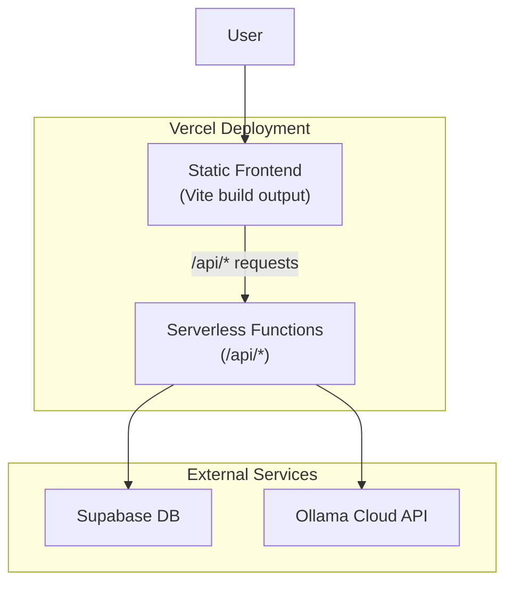

# Vercel Production Deployment Plan

## Architecture Overview

## Implementation Steps

### 1. Create Vercel Configuration

Create [`vercel.json`](vercel.json) at the project root to configure:

- Build output directory for Vite
- Rewrites to route `/api/*` requests to serverless functions
- Environment variable requirements

### 2. Create Serverless API Handler

Create [`api/[...path].ts`](api/[...path].ts) as a catch-all serverless function that wraps the Express app. This preserves all existing route logic with minimal refactoring.The handler will:

- Import the Express app from the backend
- Use `@vercel/node` to handle requests
- Skip scheduler routes (handled by GitHub Actions)

### 3. Reorganize Backend for Serverless

Move shared code to be accessible from the `/api` directory:

- Create [`api/_lib/`](api/_lib/) for shared services (Supabase client, Ollama service)
- Update import paths to use the shared frontend types from `src/types/`
- Ensure all environment variables use Vercel-compatible patterns

### 4. Update Frontend API Client

Modify [`src/utils/apiClient.ts`](src/utils/apiClient.ts) to:

- Use relative URLs in production (same domain on Vercel)
- Keep localhost fallback for local development

### 5. Update Build Scripts

Modify [`package.json`](package.json) to add:

- `build` script that outputs frontend to `dist/`
- Vercel will automatically detect the `/api` directory

### 6. Environment Variables

Configure in Vercel Dashboard:

- `SUPABASE_URL`
- `SUPABASE_SERVICE_ROLE_KEY`
- `VITE_SUPABASE_URL`
- `VITE_SUPABASE_ANON_KEY`
- `OLLAMA_API_KEY`
- `OLLAMA_MODEL` (optional)

## Files to Create

| File | Purpose ||------|---------|| `vercel.json` | Vercel configuration with rewrites || `api/[...path].ts `| Catch-all serverless function handler || `api/_lib/supabase.ts` | Shared Supabase client for serverless || `api/_lib/ollamaService.ts` | Ollama service for serverless || `api/_lib/types.ts` | Re-exports from src/types |

## Files to Modify

| File | Changes ||------|---------|| `package.json` | Add `vercel-build` script, add `@vercel/node` dev dependency || `src/utils/apiClient.ts` | Use relative URL in production |

## Local Development