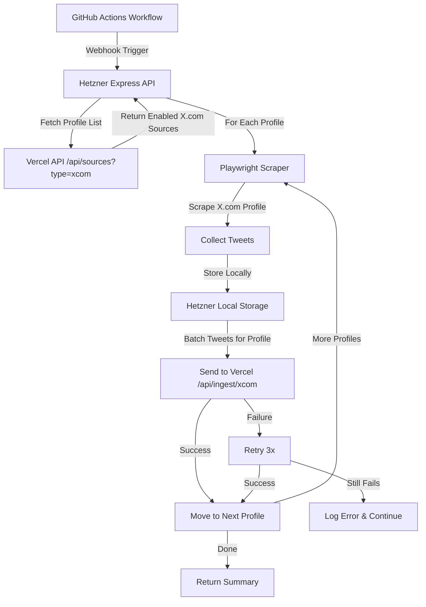

# X.com Scraping Architecture - Phased Implementation Plan

## Architecture Overview



## Key Design Decisions

1. **Source Type**: Add `'xcom'` to `source_type` enum in database
2. **Profile Management**: X.com profiles created as sources on Vercel first, Hetzner fetches enabled sources
3. **Architecture Pattern**: "Pull, Don't Push" - Hetzner discovers sources dynamically by querying Vercel API

   - GitHub Actions doesn't know about sources (source-agnostic trigger)
   - Hetzner queries Vercel API on each run to get current enabled sources
   - New sources automatically included on next scheduled run
   - No workflow changes needed when adding/removing sources

4. **Processing Model**: Strictly one profile at a time (no parallel scraping)
5. **Rate Limiting**: Enforced at scraper level (300 req/hour, 2-10s randomized delays)
6. **Data Flow**: Scrape → Store locally → Send batch to Vercel → Next profile
7. **Error Handling**: 3 retry attempts to Vercel, then log and continue
8. **Session Persistence**: Playwright `storageState` for cookie management

## Phase Breakdown

### Phase 1: Database Schema & Vercel API Endpoint (Backend)

**Objective**: Extend database to support X.com sources and create ingestion endpoint

**Tasks**:

1. **Database Migration**: Add `'xcom'` to `source_type` enum

   - File: `supabase/migrations/XXXXXX_add_xcom_source_type.sql`
   - Update `source_type` enum to include `'xcom'`
   - Update TypeScript types in `src/types/database.ts`

2. **Vercel Ingestion Endpoint**: Create `/api/ingest/xcom` endpoint

   - File: `backend/src/routes/ingest.ts` (add new route handler)
   - Accepts batch of tweets for a single profile
   - Body: `{ organization_id, source_id, tweets: Array<{title, content, url, published_at, ...}> }`
   - Uses existing `IngestionController` with batch processing
   - Returns: `{ success, added, skipped, errors }`

3. **Source Query Endpoint**: Extend `/api/sources` to filter by type

   - File: `backend/src/routes/sources.ts`
   - Add query parameter `?source_type=xcom` support
   - Return only enabled sources for Hetzner to process

4. **Update TypeScript Types**:

   - File: `src/types/database.ts` - Add `'xcom'` to source_type union
   - File: `backend/src/types/ingestion.ts` - Ensure compatibility

5. **Frontend Component Updates**:

   - File: `src/components/Sources/CreateSourceModal.tsx` - Add `'xcom'` option to source type dropdown
   - File: `src/services/osintSources.service.ts` - Update `create()` method to accept `'xcom'` sourceType
   - Validate X.com URL format (must be `https://x.com/username`)

**Dependencies**: None (foundation)

**Estimated Time**: 4-6 hours

---

### Phase 2: Hetzner Server Manual Setup (User Action)

**Objective**: Set up Hetzner CPX11 server with Docker and security configuration

**Tasks** (User performs manually, following setup guide):

1. Create Hetzner CPX11 server (Ubuntu 24.04, Ashburn VA)
2. Configure SSH keys and security (non-root user, firewall, fail2ban)
3. Install Docker and Docker Compose
4. Set up project directory structure
5. Configure environment variables (`.env` file)
6. Test Docker installation

**Reference**: `playwright_on_hetzner_cpx11_technical_setup_guide.md`

**Dependencies**: None (parallel with Phase 1)

**Estimated Time**: 2-3 hours (user time)

---

### Phase 3: Hetzner Scraper Service Implementation

**Objective**: Build Playwright-based X.com scraper with rate limiting and session management

**Tasks**:

1. **Project Structure** (on Hetzner server):
   ```
   ~/x-scraper/
   ├── Dockerfile
   ├── docker-compose.yml
   ├── package.json
   ├── .env
   ├── src/
   │   ├── index.js          # Express webhook receiver
   │   ├── scraper.js        # Playwright scraping logic
   │   ├── auth.js           # X.com authentication
   │   ├── rateLimiter.js    # Rate limiting enforcement
   │   └── utils.js          # Helper functions
   ├── sessions/             # Persistent cookie storage
   └── logs/                 # Application logs
   ```

2. **Express Webhook Server** (`src/index.js`):

   - POST `/webhook` - Receives GitHub Actions trigger
   - Validates `GITHUB_WEBHOOK_SECRET`
   - **Source Discovery**: Fetches enabled X.com sources from Vercel API
     - GET `${VERCEL_API_ENDPOINT}/api/sources?source_type=xcom&enabled=true`
     - This is where Hetzner discovers which profiles to scrape (pull model)
     - GitHub Actions doesn't know about sources - it just triggers Hetzner
     - Hetzner dynamically queries Vercel to get current enabled sources
   - Orchestrates profile-by-profile scraping
   - Returns summary with success/failure counts
   - GET `/health` - Health check endpoint

3. **X.com Authentication** (`src/auth.js`):

   - Login flow with credentials from `.env`
   - Save session to `sessions/auth.json` using `storageState`
   - Reuse existing session if valid
   - Handle login challenges and captchas (log and alert)

4. **Rate Limiter** (`src/rateLimiter.js`):

   - Track requests per hour (max 300)
   - Enforce 2-10 second randomized delays between requests
   - Exponential backoff on 429/503 errors
   - Reset counter hourly

5. **Playwright Scraper** (`src/scraper.js`):

   - Use `playwright-extra` with `puppeteer-extra-plugin-stealth`
   - Launch browser with anti-detection args
   - Load session from `sessions/auth.json`
   - Navigate to profile: `https://x.com/{username}`
   - Scroll and wait for tweets (mimic human behavior)
   - Extract tweet data: text, timestamp, URL, engagement metrics
   - Return array of normalized tweet objects
   - Handle errors: captchas (log), rate limits (backoff), network (retry)

6. **Profile Processing Orchestrator**:

   - Process one profile at a time (no parallelization)
   - For each profile:

a. Scrape tweets (with rate limiting)

b. Store locally in memory/temp file

c. Send batch to Vercel `/api/ingest/xcom`

d. Retry up to 3 times on failure

e. Log and continue if all retries fail

   - Track progress and return summary

7. **Vercel API Client**:

   - Send POST to `VERCEL_API_ENDPOINT/api/ingest/xcom`
   - Include `organization_id`, `source_id`, `tweets` array
   - Handle retries with exponential backoff
   - Log failures after 3 attempts

**Key Implementation Details**:

- Browser launch args: `--no-sandbox`, `--disable-setuid-sandbox`, `--disable-dev-shm-usage`, `--disable-gpu`
- Viewport: 1920x1080, realistic user-agent
- Wait strategies: `networkidle`, element selectors for tweets
- Session persistence: `storageState: 'sessions/auth.json'`

**Dependencies**: Phase 1 (Vercel endpoint), Phase 2 (server ready)

**Estimated Time**: 8-12 hours

---

### Phase 4: GitHub Actions Workflow

**Objective**: Create scheduled and manual trigger workflows for Hetzner webhook

**Tasks**:

1. **Scheduled Workflow** (`.github/workflows/xcom-scraping.yml`):

   - Trigger: `schedule` (hourly or configurable cron)
   - Action: POST to Hetzner webhook with secret
   - Include `GITHUB_WEBHOOK_SECRET` in headers

2. **Manual Workflow Dispatch**:

   - Add `workflow_dispatch` trigger
   - Allow manual triggering from GitHub Actions UI
   - Same webhook call as scheduled

3. **Workflow Configuration**:

   - Store `HETZNER_WEBHOOK_URL` and `GITHUB_WEBHOOK_SECRET` as GitHub secrets
   - Add error handling and notifications

**Dependencies**: Phase 3 (Hetzner webhook ready)

**Estimated Time**: 2-3 hours

---

### Phase 5: Monitoring, Logging & Error Handling

**Objective**: Implement comprehensive monitoring and error recovery

**Tasks**:

1. **Logging System**:

   - Winston logger with file rotation
   - Log levels: info, warn, error
   - Log: scrape attempts, rate limit status, Vercel API calls, errors

2. **Health Check Endpoint**:

   - GET `/health` on Hetzner server
   - Check: Docker container status, Playwright availability, session validity
   - Return JSON with status indicators

3. **Error Alerting**:

   - Log captcha encounters (alert condition)
   - Log 429 rate limit hits (warning)
   - Log Vercel API failures after 3 retries (error)
   - Track success/failure rates per profile

4. **Rate Limit Monitoring**:

   - Track requests/hour in real-time
   - Log when approaching 300 req/hour limit
   - Auto-pause if limit reached

5. **Session Management**:

   - Validate session before each scrape
   - Auto-reauth if session expired
   - Alert on repeated auth failures

**Dependencies**: Phase 3 (scraper implemented)

**Estimated Time**: 4-6 hours

---

### Phase 6: Testing & Validation

**Objective**: End-to-end testing and validation of the complete system

**Tasks**:

1. **Unit Tests** (if applicable):

   - Rate limiter logic
   - Tweet extraction parsing
   - Error handling paths

2. **Integration Testing**:

   - Test webhook trigger from GitHub Actions
   - Test profile scraping with rate limiting
   - Test Vercel API integration
   - Test retry logic on Vercel failures
   - Test session persistence and reuse

3. **Rate Limiting Validation**:

   - Verify 300 req/hour enforcement
   - Verify 2-10s delay randomization
   - Verify exponential backoff on errors

4. **End-to-End Flow**:

   - Create X.com source on Vercel
   - Trigger GitHub Actions workflow
   - Verify Hetzner scrapes profile
   - Verify tweets appear in Vercel database
   - Verify deduplication works

5. **Error Scenario Testing**:

   - Vercel API down (test retry logic)
   - X.com rate limit hit (test backoff)
   - Session expired (test reauth)
   - Invalid profile (test error handling)

**Dependencies**: All previous phases

**Estimated Time**: 6-8 hours

---

## File Structure Summary

### Vercel/Backend Files (Phase 1)

- `supabase/migrations/XXXXXX_add_xcom_source_type.sql` - Database migration
- `backend/src/routes/ingest.ts` - Add `/api/ingest/xcom` route
- `backend/src/routes/sources.ts` - Add source_type filter and accept 'xcom' in POST
- `src/types/database.ts` - Update source_type type
- `backend/src/types/ingestion.ts` - Verify compatibility
- `src/components/Sources/CreateSourceModal.tsx` - Add 'xcom' option to dropdown
- `src/services/osintSources.service.ts` - Update create() to accept 'xcom' sourceType

### Hetzner Server Files (Phase 3)

- `~/x-scraper/Dockerfile` - Docker image definition
- `~/x-scraper/docker-compose.yml` - Container orchestration
- `~/x-scraper/package.json` - Node.js dependencies
- `~/x-scraper/src/index.js` - Express webhook server
- `~/x-scraper/src/scraper.js` - Playwright scraping logic
- `~/x-scraper/src/auth.js` - X.com authentication
- `~/x-scraper/src/rateLimiter.js` - Rate limiting enforcement
- `~/x-scraper/src/utils.js` - Helper functions
- `~/x-scraper/.env` - Environment variables (not in git)

### GitHub Actions Files (Phase 4)

- `.github/workflows/xcom-scraping.yml` - Scheduled and manual triggers

## Environment Variables

### Hetzner Server (.env)

```env
X_USERNAME=scraper_account
X_PASSWORD=secure_password
VERCEL_API_ENDPOINT=https://your-site.vercel.app
GITHUB_WEBHOOK_SECRET=your_webhook_secret
```

### GitHub Secrets

- `HETZNER_WEBHOOK_URL` - Full URL to Hetzner webhook endpoint
- `GITHUB_WEBHOOK_SECRET` - Secret for webhook validation

## Rate Limiting Implementation Details

**300 Requests/Hour Enforcement**:

- Track request count in memory (reset hourly)
- Before each X.com request, check count
- If >= 300, wait until next hour window

**2-10 Second Randomized Delays**:

- After each successful request, wait random(2000, 10000)ms
- Use `setTimeout` or `sleep()` utility

**Exponential Backoff on Errors**:

- 429/503 errors: wait 2^n seconds (n = retry attempt)
- Max backoff: 60 seconds
- Retry up to 3 times before giving up

## Success Criteria

1. ✅ X.com sources can be created on Vercel
2. ✅ Hetzner successfully authenticates with X.com
3. ✅ Scraper respects 300 req/hour limit
4. ✅ Tweets are scraped and sent to Vercel in batches
5. ✅ One profile processed at a time (no parallelization)
6. ✅ Retry logic works (3 attempts to Vercel)
7. ✅ Session persistence works (no repeated logins)
8. ✅ GitHub Actions triggers scraping successfully
9. ✅ Error handling logs appropriately
10. ✅ Deduplication works (no duplicate tweets)

## Risk Mitigation

1. **X.com Detection**: Use stealth plugins, realistic delays, consistent fingerprint
2. **Rate Limit Violations**: Strict enforcement at scraper level, monitoring alerts
3. **Vercel API Failures**: 3 retry attempts, local storage as backup
4. **Session Expiry**: Auto-reauth with alerting
5. **Hetzner Server Issues**: Health checks, Docker restart policies, backups

## Source Creation Flow

### Step-by-Step: Creating an X.com Source

1. **User Action**: Navigate to `/sources` → Click "Create Source"
2. **Frontend**: `CreateSourceModal` renders with source type dropdown
3. **User Input**: Select `'xcom'` type, enter profile name/URL (e.g., `https://x.com/elonmusk`)
4. **Frontend Service**: `osintSourcesService.create()` called with `sourceType: 'xcom'`
5. **Backend API**: POST `/api/sources` with `source_type: 'xcom'`
6. **Database**: INSERT into `sources` table with `enabled: true` (default)
7. **Response**: Source created and stored in Supabase
8. **UI Update**: Sources list refreshes, new X.com source appears

### Source Discovery Flow (When Scraping Runs)

1. **GitHub Actions**: Triggers on schedule (cron) or manual dispatch

   - **Note**: GitHub Actions doesn't know about sources - it's source-agnostic

2. **Hetzner Webhook**: Receives POST `/webhook` from GitHub Actions
3. **Source Discovery**: Hetzner queries Vercel API:

   - `GET /api/sources?source_type=xcom&enabled=true`
   - Vercel queries Supabase and returns all enabled X.com sources

4. **Processing**: Hetzner processes each source sequentially
5. **Ingestion**: Scraped tweets sent to `POST /api/ingest/xcom`

**Key Point**: Sources are created on Vercel first, then discovered dynamically by Hetzner on each run. This is a "pull" model where Hetzner queries for sources rather than being notified about them.

## Timeline Estimate

- **Phase 1**: 4-6 hours
- **Phase 2**: 2-3 hours (user time, can parallel with Phase 1)
- **Phase 3**: 8-12 hours
- **Phase 4**: 2-3 hours
- **Phase 5**: 4-6 hours
- **Phase 6**: 6-8 hours

**Total**: 26-38 hours of development time + 2-3 hours user setup time