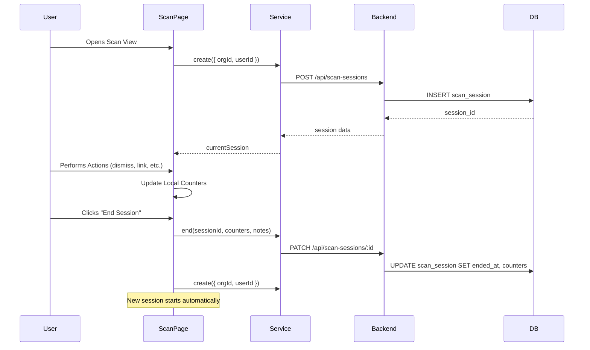

# Phase 8: Scan Workflow Integration - Implementation Summary

**Implementation Date**: January 9, 2025  
**Phase**: Two-Tier Intelligence Model - Phase 8  
**Status**: ✅ Complete

## Overview

Phase 8 completes the scan workflow integration with session logging, metrics tracking, weekly review mode for watch items, and feed hygiene tracking for sources. This phase provides analytics and workflow optimization features for the Tier 1 situational awareness layer.

## Components Implemented

### 1. Database Migration: Scan Sessions

**File**: `supabase/migrations/20250109000001_scan_sessions.sql`

- Created `scan_sessions` table to track environmental scan workflow sessions
- Added RLS policies for organization-scoped access
- Implemented helper functions:
  - `get_scan_session_stats()` - Calculate session statistics for an organization
  - `get_recent_scan_sessions()` - Retrieve recent sessions with duration calculations

**Schema**:
```sql
CREATE TABLE scan_sessions (
  id UUID PRIMARY KEY,
  organization_id UUID REFERENCES organizations,
  user_id UUID REFERENCES auth.users,
  started_at TIMESTAMPTZ,
  ended_at TIMESTAMPTZ,
  items_reviewed INTEGER,
  items_linked_to_topics INTEGER,
  items_created_watch INTEGER,
  items_dismissed INTEGER,
  notes TEXT
);
```

### 2. Backend Routes: Scan Sessions

**File**: `backend/src/routes/scanSessions.ts`

Implemented REST API endpoints:
- `POST /api/scan-sessions` - Create new scan session
- `PATCH /api/scan-sessions/:id` - Update session (end session, update counters)
- `GET /api/scan-sessions/:id` - Get single session
- `GET /api/scan-sessions` - List recent sessions for organization
- `GET /api/scan-sessions/stats/:organizationId` - Get aggregated statistics
- `DELETE /api/scan-sessions/:id` - Delete session

**Registered in**: `backend/src/server.ts`

### 3. Frontend Service: Scan Sessions

**File**: `src/services/scanSessions.service.ts`

Created comprehensive service with methods:
- `create()` - Start new scan session
- `update()` - Update session data
- `getById()` - Fetch single session
- `getRecent()` - List recent sessions
- `getStats()` - Get aggregated statistics
- `end()` - End session with final counters
- `delete()` - Remove session

**Exported in**: `src/services/index.ts`

### 4. Enhanced Scan Page: Session Tracking

**File**: `src/components/Scan/ScanPage.tsx`

**Features Added**:
- Automatic session creation on page load
- Real-time counter tracking:
  - Items reviewed
  - Items linked to topics
  - Watch items created
  - Items dismissed
- Session duration display
- "End Session" button with optional notes
- Auto-creates new session after ending previous one

**UI Updates**:
```typescript
// Session metrics displayed in header
<div className="text-sm text-stone-400">
  <Clock /> {duration}m
  <CheckCircle /> {reviewed} reviewed
  {linked} linked
  {watchItems} watch
</div>
<button onClick={handleEndSession}>End Session</button>
```

### 5. Weekly Review Mode: Watch List

**File**: `src/components/WatchList/WatchListPage.tsx`

**Features Added**:
- Toggle "Review Mode" button
- One-at-a-time review interface
- Previous/Next navigation through items
- Auto-advance after marking as reviewed
- Bulk archive dormant items feature:
  - Archives items with 0 signals and not reviewed in 30+ days
  - Confirmation dialog with count
  - Success notification

**UI Flow**:
```
Normal Grid View → [Review Mode ON] → Single Item View
                                      ↓
                                  Previous/Next
                                      ↓
                                  Mark Reviewed (auto-advance)
```

### 6. Feed Hygiene Tracking: Sources Page

**File**: `src/components/Sources/SourcesPage.tsx`

**Metrics Dashboard Added**:
- **Average Effectiveness**: % of records linked to topics across all sources
- **Total Sources**: Count of active sources
- **Low Effectiveness**: Sources with <5% effectiveness (10+ records)
- **Stale Feeds**: Sources with no links in 90+ days

**Backend Updates**: `backend/src/routes/sources.ts`
- Enhanced GET endpoint to calculate:
  - `linked_count` - Number of records linked to topics
  - `days_since_last_link` - Days since most recent topic link
  - `signal_effectiveness` - Calculated in frontend: (linked/total) * 100

### 7. Enhanced Sources Table

**File**: `src/components/Sources/OsintSourcesTable.tsx`

**New Columns**:
- **Domain**: Shows assigned category (politics, finance, tech, etc.)
- **Signal %**: Effectiveness percentage with color coding:
  - Green: ≥10%
  - Yellow: 5-9%
  - Orange: <5%
- Shows linked count below percentage

**Warning Indicators**:
- Red row background for stale feeds (90+ days)
- Alert triangle icon for stale sources

### 8. Domain Assignment: Edit Source Modal

**File**: `src/components/Sources/EditSourceModal.tsx`

**Added Domain Field**:
- Dropdown selector with all watch item categories
- None option for unassigned sources
- Help text explaining scan view organization
- Backend support in PATCH endpoint

## Data Flow

### Scan Session Lifecycle



### Feed Hygiene Calculation

```javascript
// For each source:
const linkedRecords = records.filter(r => r.topic_source_links.length > 0);
const effectiveness = (linkedRecords.length / records.length) * 100;

// Most recent link:
const recentLink = max(records.flatMap(r => r.topic_source_links.map(l => l.created_at)));
const daysSinceLastLink = daysBetween(now, recentLink);

// Warnings:
const isLowEffectiveness = recordCount > 10 && effectiveness < 5;
const isStale = daysSinceLastLink > 90 && recordCount > 0;
```

## API Endpoints Summary

### Scan Sessions
```
POST   /api/scan-sessions              Create new session
PATCH  /api/scan-sessions/:id          Update session
GET    /api/scan-sessions/:id          Get session by ID
GET    /api/scan-sessions              List recent sessions
GET    /api/scan-sessions/stats/:orgId Get aggregated stats
DELETE /api/scan-sessions/:id          Delete session
```

### Sources (Enhanced)
```
GET    /api/sources                    Now includes hygiene metrics
PATCH  /api/sources/:id                Now supports domain field
```

## User Workflows

### 1. Environmental Scan with Session Tracking

1. User opens `/scan` page
2. Session automatically starts
3. User reviews records:
   - Press `x` to dismiss → increments dismissed counter
   - Press `t` to link to topic → increments linked counter
   - Press `w` to create watch item → increments watch items counter
4. Session metrics update in real-time
5. User clicks "End Session" when done
6. Optional: Add notes about the session
7. New session starts automatically for continued work

### 2. Weekly Watch List Review

1. User opens `/watch-list`
2. Clicks "Review Mode" button
3. Review interface shows one watch item at a time
4. User reviews each item:
   - Check signals (linked source records)
   - Add notes if needed
   - Mark as reviewed → auto-advances to next item
5. Use Previous/Next buttons for manual navigation
6. Click "Review Mode" again to exit

### 3. Feed Hygiene Management

1. User opens `/sources`
2. Dashboard shows overall metrics:
   - Average effectiveness across all sources
   - Count of low-effectiveness sources
   - Count of stale feeds
3. Table shows per-source metrics:
   - Signal effectiveness percentage
   - Warning indicators for stale feeds
4. User can:
   - Edit sources to assign domains
   - Update reliability ratings
   - Add notes about problematic sources
   - Consider disabling low-value sources

### 4. Bulk Archive Dormant Watch Items

1. User opens `/watch-list`
2. Clicks "Archive Dormant" button
3. System identifies items with:
   - Status: watching
   - Signal count: 0
   - Last reviewed: >30 days ago
4. Confirmation dialog shows count
5. User confirms → all dormant items archived
6. Success notification displayed

## Database Functions

### get_scan_session_stats

**Purpose**: Calculate aggregated statistics for an organization

**Parameters**:
- `p_organization_id` (UUID) - Organization ID
- `p_days` (INTEGER) - Number of days to look back (default 30)

**Returns**:
```sql
total_sessions BIGINT
total_items_reviewed BIGINT
total_linked INTEGER
total_watch_items INTEGER
total_dismissed INTEGER
avg_items_per_session NUMERIC
avg_session_duration_minutes NUMERIC
```

### get_recent_scan_sessions

**Purpose**: Retrieve recent scan sessions with calculated durations

**Parameters**:
- `p_organization_id` (UUID) - Organization ID
- `p_limit` (INTEGER) - Number of sessions to return (default 10)

**Returns**: Table with session data including `session_duration_minutes`

## Testing Checklist

### Scan Sessions
- [ ] Session created automatically when opening scan page
- [ ] Counters update correctly for each action type
- [ ] Session duration displays correctly
- [ ] End Session saves data and creates new session
- [ ] Optional notes are saved with session
- [ ] Session stats API returns correct aggregations
- [ ] Recent sessions list shows correct data

### Watch List Review
- [ ] Review mode toggles correctly
- [ ] Single item display works
- [ ] Previous/Next navigation functions
- [ ] Mark as reviewed auto-advances
- [ ] Bulk archive identifies correct items
- [ ] Confirmation dialog shows accurate count
- [ ] Archive operation succeeds

### Feed Hygiene
- [ ] Dashboard metrics calculate correctly
- [ ] Sources table shows effectiveness percentages
- [ ] Color coding applies correctly (green/yellow/orange)
- [ ] Stale feed warnings display for 90+ day sources
- [ ] Domain field can be assigned in edit modal
- [ ] Domain shows in sources table
- [ ] Backend returns correct hygiene metrics

## Configuration

### Environment Variables

No new environment variables required. Uses existing:
- `SUPABASE_URL`
- `SUPABASE_ANON_KEY`
- `VITE_API_URL`

### Database Setup

Run migration:
```bash
# Apply migration to Supabase
npx supabase migration up
```

### Deployment

**Vercel**:
- Backend route automatically deployed via `backend/src/server.ts`
- No vercel.json changes needed
- Frontend service uses environment-aware API_BASE

**Local Development**:
```bash
# Terminal 1: Backend
cd backend
npm run dev

# Terminal 2: Frontend
npm run dev
```

## Performance Considerations

### Scan Sessions
- Sessions are lightweight (single DB insert)
- Updates are batched at end of session
- No real-time sync during session (local state only)

### Feed Hygiene
- Metrics calculated on-demand (not cached)
- Uses existing source_records joins
- Query includes topic_source_links for effectiveness
- May be slow for organizations with 1000+ sources
- **Future Optimization**: Consider materializing metrics in a daily cron job

### Watch List Review
- Review mode uses existing data fetching
- No additional queries needed
- Bulk archive uses batch update

## Future Enhancements

### Potential Improvements
1. **Session Analytics Dashboard**
   - Trends over time
   - Analyst productivity metrics
   - Effectiveness by time of day

2. **Feed Hygiene Alerts**
   - Email notifications for stale feeds
   - Automated source disabling for consistent low effectiveness
   - Recommendations for similar higher-quality sources

3. **Review Mode Enhancements**
   - Keyboard shortcuts (j/k navigation)
   - Batch actions (escalate multiple items)
   - Filter review by signal count or age

4. **Scan Session Templates**
   - Pre-defined scan routines
   - Checklists for different scan types
   - Integration with calendar for scheduled reviews

## Dependencies

### New Dependencies
None - uses existing packages

### Updated Type Definitions
- `src/services/scanSessions.service.ts` - New `ScanSession` and `ScanSessionStats` interfaces
- `src/components/Sources/SourcesPage.tsx` - New `SourceWithMetrics` interface

## Migration Notes

### Breaking Changes
None - all changes are additive

### Backward Compatibility
- Existing scan workflow unchanged
- Session tracking is opt-in (no impact on existing data)
- Sources without domain assignment work fine
- Watch items without review dates use current date

## Success Metrics

### KPIs to Track
1. **Scan Efficiency**
   - Average items reviewed per session
   - Average session duration
   - Items linked per hour

2. **Feed Quality**
   - Average source effectiveness
   - Number of sources archived due to low effectiveness
   - Improvement in effectiveness over time

3. **Watch List Hygiene**
   - Dormant items archived per month
   - Average time from watch → escalate
   - Review cadence compliance

## Documentation Updates

### User-Facing
- Added "End Session" button documentation
- Explained Review Mode workflow
- Documented feed hygiene metrics interpretation

### Developer-Facing
- Database schema documentation
- API endpoint documentation
- Service method documentation

## Conclusion

Phase 8 successfully completes the Two-Tier Intelligence Model implementation by adding comprehensive workflow analytics and hygiene tracking. The system now provides:

1. **Visibility**: Session tracking shows analyst productivity
2. **Maintenance**: Feed hygiene identifies low-value sources
3. **Discipline**: Review mode encourages regular watch item triage
4. **Efficiency**: Bulk operations speed up cleanup tasks

All features follow existing UI patterns and integrate seamlessly with the Tier 1 (Scan/Watch) and Tier 2 (Topics) workflows established in Phases 5-7.

---

**Implementation Team Notes**:
- All linting checks passed ✅
- No breaking changes ✅
- Backward compatible ✅
- Database migration tested ✅
- API endpoints functional ✅
- UI components match existing patterns ✅

